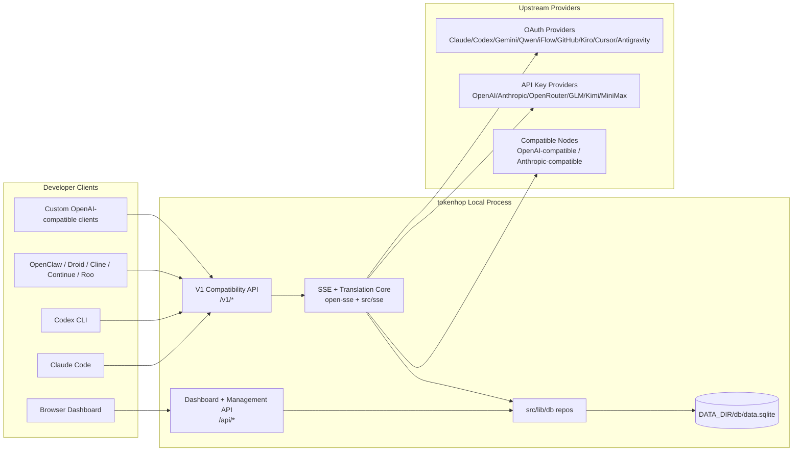
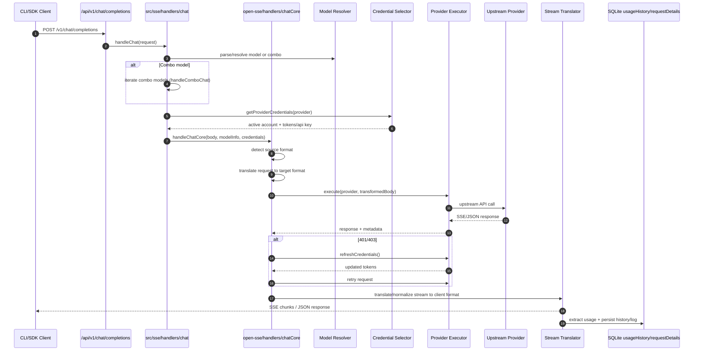
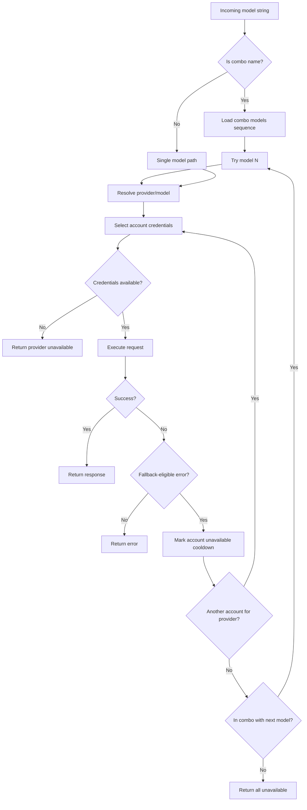
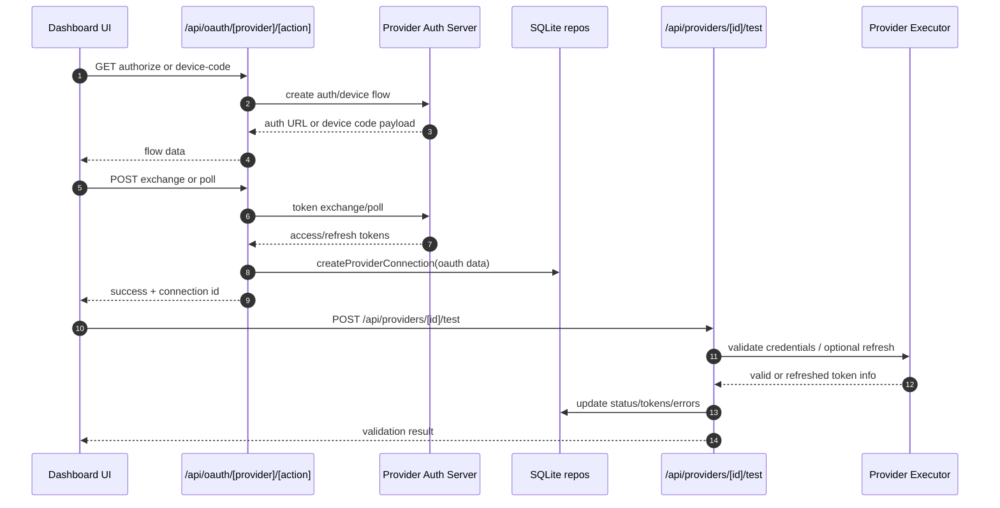
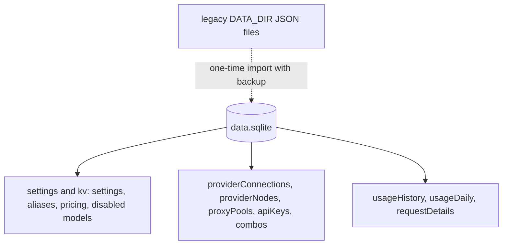

# tokenhop Architecture

_Last updated: 2026-09-27_

## Executive Summary

tokenhop is a local AI routing gateway and dashboard built on Next.js.
It provides a single OpenAI-compatible endpoint (`/v1/*`) and routes traffic across multiple upstream providers with translation, fallback, token refresh, and usage tracking.

Core capabilities:

- OpenAI-compatible API surface for CLI/tools
- Request/response translation across provider formats
- Model combo fallback (multi-model sequence)
- Account-level fallback (multi-account per provider)
- OAuth + API-key provider connection management
- Local persistence for providers, keys, aliases, combos, settings, pricing
- Usage/cost tracking and request details (with conversation redaction on read)
- Optional remote/cloud base URL selection for CLI tools (full provider sync scheduler is not present in this ref)

Primary runtime model:

- Next.js app routes under `src/app/api/*` implement both dashboard APIs and compatibility APIs
- A shared SSE/routing core in `src/sse/*` + `open-sse/*` handles provider execution, translation, streaming, fallback, and usage

## Scope and Boundaries

### In Scope

- Local gateway runtime
- Dashboard management APIs
- Provider authentication and token refresh
- Request translation and SSE streaming
- Local state + usage/request persistence in SQLite
- Reliability policy enforcement (retry, cooldown, backoff, stream timeouts)

### Out of Scope

- Provider SLA/control plane outside local process
- External CLI binaries themselves (Claude CLI, Codex CLI, etc.)
- Multi-device provider-state cloud synchronization (legacy scheduler/sync routes are absent from this ref)

## High-Level System Context



Cloud sync's documented control route/scheduler (`src/lib/initCloudSync.js`, `src/shared/services/cloudSyncScheduler.js`, `/api/sync/cloud`) is not present at HEAD. `settingsRepo.cloudEnabled`/`cloudUrl` remain, used for CLI-tools base-URL selection — see "Cloud-Related Settings" below.

## Core Runtime Components

## 1) API and Routing Layer (Next.js App Routes)

Main directories:

- `src/app/api/v1/*` and `src/app/api/v1beta/*` for compatibility APIs
- `src/app/api/*` for management/configuration APIs
- Next rewrites in `next.config.mjs` map `/v1/*` to `/api/v1/*`

Important compatibility routes:

- `src/app/api/v1/chat/completions/route.js`
- `src/app/api/v1/messages/route.js`
- `src/app/api/v1/responses/route.js`
- `src/app/api/v1/models/route.js`
- `src/app/api/v1/messages/count_tokens/route.js`
- `src/app/api/v1beta/models/route.js`
- `src/app/api/v1beta/models/[...path]/route.js`

Management domains (deny-by-default in `dashboardGuard`; every route's access is declared in the route → capability table `src/lib/auth/routePolicy.js`, and unmapped routes fail closed):

- Home feeds: `src/app/api/home/{summary, live-routes, quota}`
- Auth/settings: `src/app/api/auth/*`, `src/app/api/settings/*` (incl. `/config/{export,import}`, `/database`)
- Providers/connections: `src/app/api/providers*`
- Provider nodes: `src/app/api/provider-nodes*`
- Proxy pools: `src/app/api/proxy-pools*`
- OAuth: `src/app/api/oauth/*`
- Keys/aliases/combos/pricing: `src/app/api/keys*`, `src/app/api/models/alias`, `src/app/api/combos*` (incl. `/[id]/test`), `src/app/api/pricing`
- Usage: `src/app/api/usage/*` (incl. `request-logs`, `request-details` redacted)
- CLI tooling helpers: `src/app/api/cli-tools/*`
- Legacy cloud settings only (no active sync routes at HEAD)

## 2) SSE + Translation Core

Main flow modules:

- Entry: `src/sse/handlers/chat.js`
- Core orchestration: `open-sse/handlers/chatCore.js`
- Provider execution adapters: `open-sse/executors/*`
- Format detection/provider config: `open-sse/services/provider.js`
- Model parse/resolve: `src/sse/services/model.js`, `open-sse/services/model.js`
- Account fallback logic: `open-sse/services/accountFallback.js`
- Translation registry: `open-sse/translator/index.js`
- Stream transformations: `open-sse/utils/stream.js`, `open-sse/utils/streamHandler.js`
- Usage extraction/normalization: `open-sse/utils/usageTracking.js`

## 3) Persistence Layer

SQLite is the source of truth for configuration, routing state, usage, and request details. `src/lib/db/index.js` exposes the repository API; entity operations live in `src/lib/db/repos/*`. `src/lib/localDb.js` and `src/lib/usageDb.js` remain backward-compatible re-export shims.

- Database file: `<DATA_DIR>/db/data.sqlite`; backups: `<DATA_DIR>/db/backups`. `DATA_DIR` defaults to the platform data directory (typically `~/.tokenhop` on Unix, or an existing legacy data dir) and can fall back if configured storage is unwritable. Docker sets `DATA_DIR=/app/data`.
- Adapter order: Bun uses `bun:sqlite`, then `sql.js`; Node tries `better-sqlite3` (skipped on Node >=24), `node:sqlite` (Node >=22.5), then `sql.js`. Startup fails if no driver initializes.
- Schema lives in `src/lib/db/schema.js`; versioned migrations (`src/lib/db/migrations/`, frozen v1.0.0 baseline `001` plus idempotent `002+`, helpers for table rebuilds and backfills) run transactionally with foreign keys checked, after a DB backup whenever any migration is pending, followed by additive schema synchronization. Database exports carry `schemaVersion`; importing a newer one is refused. Legacy JSON files under `DATA_DIR` (`db.json`, `usage.json`, `disabledModels.json`, `request-details.json`) are one-time import sources: migration backs them up, retains originals, and checks imported row counts. Malformed legacy JSON is not guaranteed to import.
- Tables: `_meta`, `settings`, `providerConnections`, `providerNodes`, `proxyPools`, `apiKeys`, `combos`, `kv`, `usageHistory`, `usageDaily`, and `requestDetails`. Several entities store JSON in `data`; aliases, pricing, and disabled models use `kv`. Indexed `connectionId` values are not declared foreign keys.
- Usage history/daily aggregates and recent-request lines derive from SQLite. Optional buffered details live in `requestDetails`; `/api/usage/request-details` redacts conversation content. Optional deep request/translator debug files under the runtime working directory's `logs/` are separate from SQLite and are not the legacy `log.txt`.

`saveRequestUsage` writes usage history and daily aggregates. `appendRequestLog()` is a no-op; `getRecentLogs()` formats recent usage rows.

## 4) Auth + Security Surfaces

- Dashboard cookie auth: `src/proxy.js`, `src/app/api/auth/login/route.js`
- API key generation/verification: `src/shared/utils/apiKey.js`
- Provider secrets persisted in `providerConnections` entries
- Optional proxy support for upstream calls via env proxy variables (`open-sse/utils/proxyFetch.js`)

## 5) Cloud-Related Settings

The previously documented cloud-sync scheduler and control route are absent from this revision. Stored `cloudEnabled`/`cloudUrl` settings remain and influence CLI-tools target URL selection; do not infer provider-state synchronization from these settings.

## Request Lifecycle (`/v1/chat/completions`)



## Combo + Account Fallback Flow



Fallback decisions are driven by `open-sse/services/accountFallback.js` using status codes and error-message heuristics. Reliability controls (retry 502/503/504 tries/delays, cooldown windows, backoff levels, stream first-chunk/stall/connect timeouts) come from `open-sse/config/reliabilityPolicy.js` with precedence: built-in defaults < stored settings slice < positive timeout env values only (`STREAM_FIRST_CHUNK_TIMEOUT_MS`, `STREAM_STALL_TIMEOUT_MS`, `FETCH_CONNECT_TIMEOUT_MS`). Bootstrapped in Node `src/instrumentation.js` and awaited on first `/v1` via `ensureReliabilityPolicy`; successful `PATCH /api/settings` re-injects without restart. Fail-open to defaults/prior policy. 429 never retries.

## OAuth Onboarding and Token Refresh Lifecycle



Refresh during live traffic is executed inside `open-sse/handlers/chatCore.js` via executor `refreshCredentials()`.

## Cloud-Related Settings (No Sync Lifecycle)

The previously documented cloud-sync lifecycle (enable/sync/disable) is not present at this revision: `src/lib/initCloudSync.js`, `src/shared/services/cloudSyncScheduler.js`, and `/api/sync/cloud` do not exist in HEAD. Stored `cloudEnabled` and `cloudUrl` settings persist and are used to pick the CLI-tools base URL (local gateway vs cloud): `settingsRepo.getCloudUrl()` resolves `settings.cloudUrl`, then `CLOUD_URL`, then `NEXT_PUBLIC_CLOUD_URL`, and the dashboard hook `src/app/(dashboard)/dashboard/cli-tools/hooks/useToolSetupData.js` reads the cloud mode. No provider-state synchronization is performed from these settings.

## Data Model and Storage Map

Storage is a single SQLite database at `<DATA_DIR>/db/data.sqlite`. Logical grouping (no database-enforced foreign keys; `connectionId` is an indexed column without `REFERENCES`):



Notes:

- `settings`: one JSON row; includes `requireLogin`, `startPage`, `uiDensity`, `cloudEnabled`, `cloudUrl`, reliability keys, and observability toggles.
- `kv`: aliases, user pricing, disabled models (scoped key-value).
- `providerConnections`, `providerNodes`, `proxyPools`: each row carries a JSON `data` blob plus core columns (provider/authType, type, isActive/testStatus).
- `combos`: models stored as JSON.
- `usageHistory` / `usageDaily`: per-request aggregates and daily rollups.
- `requestDetails`: optional buffered per-request detail rows (redacted on read via `/api/usage/request-details`).
- `_meta`: schema version metadata.
- Legacy `db.json`, `usage.json`, `disabledModels.json`, `request-details.json` under `DATA_DIR` are one-time import sources only (backup + row-count checks); `log.txt` is not an import source.

Optional deep request/translation debug logs still land in `<process.cwd()>/logs` when `ENABLE_REQUEST_LOGS=true` — distinct from SQLite and not the removed `log.txt`. Credential headers are masked, but the logs still contain full request/response bodies.

## Deployment Topology

```mermaid
flowchart LR
    subgraph LocalHost[Developer Host]
        Browser[Dashboard Browser]
        Clients[CLI/SDK clients]
        Launcher[Optional npm CLI launcher (cli/)]
    end

    subgraph ContainerOrProcess[tokenhop Runtime]
        Next[Next.js server]
        Core[SSE Core + Executors]
        SQLITE[(DATA_DIR/db/data.sqlite)]
    end

    subgraph External[External Services]
        Providers[AI Providers]
    end

    Browser --> Next
    Clients --> Next
    Launcher --> Next
    Next --> Core
    Next --> SQLITE
    Core --> SQLITE
    Core --> Providers
```

Deployment paths:

- Source: `npm run build && npm run start` (default port 20127).
- Docker: `node custom-server.js`, `ENV PORT=20128`, `ENV DATA_DIR=/app/data` → SQLite at `/app/data/db/data.sqlite`.
- Dev compose: `compose.dev.yml` uses `PORT=20127` with a bind mount.
- CLI launcher (`cli/`, npm package `tokenhop`): optional local distribution/control plane — bundles and spawns the Next server, installs/heals optional SQLite drivers. Distinct from the dashboard's CLI-tools page and compatibility client binaries.

## Module Mapping (Decision-Critical)

### Route and API Modules

- `src/app/api/v1/*`, `src/app/api/v1beta/*`: compatibility APIs
- `src/app/api/providers*`: provider CRUD, validation, testing
- `src/app/api/provider-nodes*`: custom compatible node management
- `src/app/api/oauth/*`: OAuth/device-code flows
- `src/app/api/keys*`: local API key lifecycle
- `src/app/api/models/alias`: alias management
- `src/app/api/combos*`: fallback combo management
- `src/app/api/pricing`: pricing overrides for cost calculation
- `src/app/api/usage/*`: usage and logs APIs (incl. `request-logs`, `request-details` redacted)
- `src/app/api/home/*`: Home summary, live-routes, quota feeds
- `src/app/api/proxy-pools*`: proxy-pool CRUD
- `src/app/api/settings/config/{export,import}`: portable config (secrets excluded) with password/CLI-token confirmation
- `src/app/api/combos/[id]/test`: combo probe (rate-limited, 60s HTTP timeout; executor not aborted)
- `src/app/api/cli-tools/*`: local CLI config writers/checkers (local-only)

### Routing and Execution Core

- `src/sse/handlers/chat.js`: request parse, combo handling, account selection loop
- `open-sse/handlers/chatCore.js`: translation, executor dispatch, retry/refresh handling, stream setup
- `open-sse/executors/*`: provider-specific network and format behavior

### Translation Registry and Format Converters

- `open-sse/translator/index.js`: translator registry and orchestration
- Request translators: `open-sse/translator/request/*`
- Response translators: `open-sse/translator/response/*`
- Format constants: `open-sse/translator/formats.js`

### Persistence

- `src/lib/db/`: SQLite adapter chain (`driver.js`), schema/migrations (`schema.js`, `migrations/`), repos (`repos/*`)
- `src/lib/db/index.js`: public barrel over repos (settings, connections, nodes, pools, keys, combos, aliases, pricing, disabled models, usage, request details, and the users & teams identity/tenancy repos — users, identities, workspaces, memberships — which take a `Principal` from `src/lib/users/principal.js` and are unused until the multi-user switch is on)
- `src/lib/localDb.js`, `src/lib/usageDb.js`: backward-compat re-export shims — import from `@/lib/db/index.js` in new code

### Dashboard UI

- `src/app/(dashboard)/layout.js` → `DashboardLayout` (Signal shell): skip link, desktop Sidebar, mobile Drawer, Header, toasts, CommandPalette; basic-chat is a special full-height layout.
- `/dashboard` renders Home (endpoint hero, keys, stats, live routes, recent requests, quota, combos, provider health) fed by `/api/home/*` and `/api/usage*`.
- Sidebar nav groups: Route, Watch, Tune, Debug (Translator conditional on `ENABLE_TRANSLATOR` flag).
- `/` redirects to configured `startPage` (allowlisted) or `/dashboard`.
- Consolidated `/dashboard/settings` renders `SETTINGS_GROUPS` tabs (Account, Traffic, Models & usage, System) from the section registry; legacy `/dashboard/profile` and `/dashboard/settings/pricing` redirect client-side (query/hash preserved). Home feeds: `/api/home/{summary, live-routes, quota}`.
- Density: `nr-density` cookie applied pre-paint; theme default dark on fresh installs only.

## Provider Executor Coverage

Specialized executors:

- `antigravity`
- `gemini-cli`
- `github`
- `kiro`
- `codex`
- `cursor`

Default executor path:

- all other providers (including compatible node providers) use `open-sse/executors/default.js`

## Format Translation Coverage

Detected source formats include:

- `openai`
- `openai-responses`
- `claude`
- `gemini`

Target formats include:

- OpenAI chat/Responses
- Claude
- Gemini/Gemini-CLI/Antigravity envelope
- Kiro
- Cursor

Translations are selected dynamically based on source payload shape and provider target format.

## Failure Modes and Resilience

## 1) Account/Provider Availability

- provider account cooldown on transient/rate/auth errors
- account fallback before failing request
- combo model fallback when current model/provider path is exhausted

## 2) Token Expiry

- pre-check and refresh with retry for refreshable providers
- 401/403 retry after refresh attempt in core path

## 3) Stream Safety

- disconnect-aware stream controller
- translation stream with end-of-stream flush and `[DONE]` handling
- usage estimation fallback when provider usage metadata is missing

## 4) Reliability Policy Boot

- bootstrapped at server start (Node instrumentation) and on first `/v1` request (shared promise)
- read failure is fail-open: defaults / prior policy remain in effect
- retry/cooldown/backoff are not env-overridable; only positive timeout values

## 5) Data Integrity

- versioned migrations run in transactions, then additive schema sync; pre-change backups
- one-time legacy JSON import with backup, row-count checks, retained originals
- malformed legacy JSON (`readJsonSafe` null) is skipped, not fully migrated

## Observability and Operational Signals

Runtime visibility sources:

- console logs from `src/sse/utils/logger.js` (buffered via `initConsoleLogCapture`, exposed in console-log page)
- per-request usage aggregates in SQLite `usageHistory` / daily rollups in `usageDaily`
- recent-request formatted lines from `usageHistory` via `/api/usage/request-logs`
- buffered detail rows in `requestDetails` (redacted conversation fields via `/api/usage/request-details`)
- optional deep request/translation debug files under working directory `logs/` when `ENABLE_REQUEST_LOGS=true` (separate from SQLite)
- dashboard usage endpoints (`/api/usage/*`) for UI consumption

## Security-Sensitive Boundaries

Layered auth (enforced in `src/proxy.js` → `src/dashboardGuard.js`; every `/api/*` route and method maps to a capability in `src/lib/auth/routePolicy.js`; unmapped routes fail closed):

- Public LLM prefixes (`/v1`, `/v1beta`, `/codex`, `/responses`): local peer (loopback host+origin, trusted peer headers only from loopback reverse proxy via `custom-server.js`), or validated CLI token, or valid API key.
- Ordinary management `/api/*`: JWT session, validated CLI token (`machineId`-bound), or `requireLogin=false` broadens access — never assume every management API requires JWT.
- Local-only / host-secret routes (`/api/cli-tools/*`, `/api/mcp/*`, headroom, tunnel toggles, oauth auto-import, reset-password): local peer with origin check PLUS dashboard auth or CLI token.
- Always-protected routes (`/api/shutdown`, `/api/settings/database`, oauth auto-import): JWT or CLI token regardless of `requireLogin`; DB route adds its own password check.
- Portable config (`/api/settings/config/export`, `import`): validated CLI token or password confirmation header — additional gate on top of the guard.
- Dashboard pages: JWT or `requireLogin=false`; Translator page additionally requires `ENABLE_TRANSLATOR` flag.
- JWT secret (`JWT_SECRET`) secures dashboard session cookie verification/signing
- Initial password fallback (`INITIAL_PASSWORD`, default `123456`) must be overridden in real deployments
- API key HMAC secret (`API_KEY_SECRET`) secures generated local API key format
- Provider secrets (API keys/tokens) are persisted in SQLite and should be protected at filesystem level

## Environment and Runtime Matrix

Environment variables actively used by code:

- App/auth: `JWT_SECRET`, `INITIAL_PASSWORD`
- Storage: `DATA_DIR`
- Security hashing: `API_KEY_SECRET`, `MACHINE_ID_SALT`
- Logging: `ENABLE_REQUEST_LOGS`, `ENABLE_TRANSLATOR`
- Stream timeouts: `STREAM_FIRST_CHUNK_TIMEOUT_MS`, `STREAM_STALL_TIMEOUT_MS`, `FETCH_CONNECT_TIMEOUT_MS`
- Cloud URL (CLI target selection): `CLOUD_URL`, `NEXT_PUBLIC_CLOUD_URL`
- Public base URL: `NEXT_PUBLIC_BASE_URL`, `BASE_URL`
- Outbound proxy: `HTTP_PROXY`, `HTTPS_PROXY`, `ALL_PROXY`, `NO_PROXY` and lowercase variants
- Platform/runtime helpers (not app-specific config): `APPDATA`, `NODE_ENV`, `PORT`, `HOSTNAME`

## Known Architectural Notes

1. `/api/v1/route.js` re-exports `GET`/`OPTIONS` from `./models/route` — it serves the live model list, not a static one.
2. Request logger writes full headers/body when enabled; treat the `logs/` directory as sensitive.
3. Cloud-related settings (`cloudEnabled`, `cloudUrl`) only influence CLI-tools base-URL selection; no provider sync is performed at this revision.
4. Legacy `/dashboard/profile` and `/dashboard/settings/pricing` redirect client-side to `/dashboard/settings` (hash/query preserved) — no server-side permanent redirects.

## Operational Verification Checklist

- Build from source: `npm run build` (from repo root)
- Build Docker image: `docker build -t tokenhop .`
- Start service: `npm run start` (default port 20127) or Docker (port 20128)
- Verify: `GET /api/settings` (requires dashboard auth or CLI token / `requireLogin=false`), `GET /api/v1/models` (public LLM API — local peer, CLI token, or valid API key)
- CLI target base URL should be `http://<host>:<PORT>/v1` (20127 source default, 20128 Docker)
