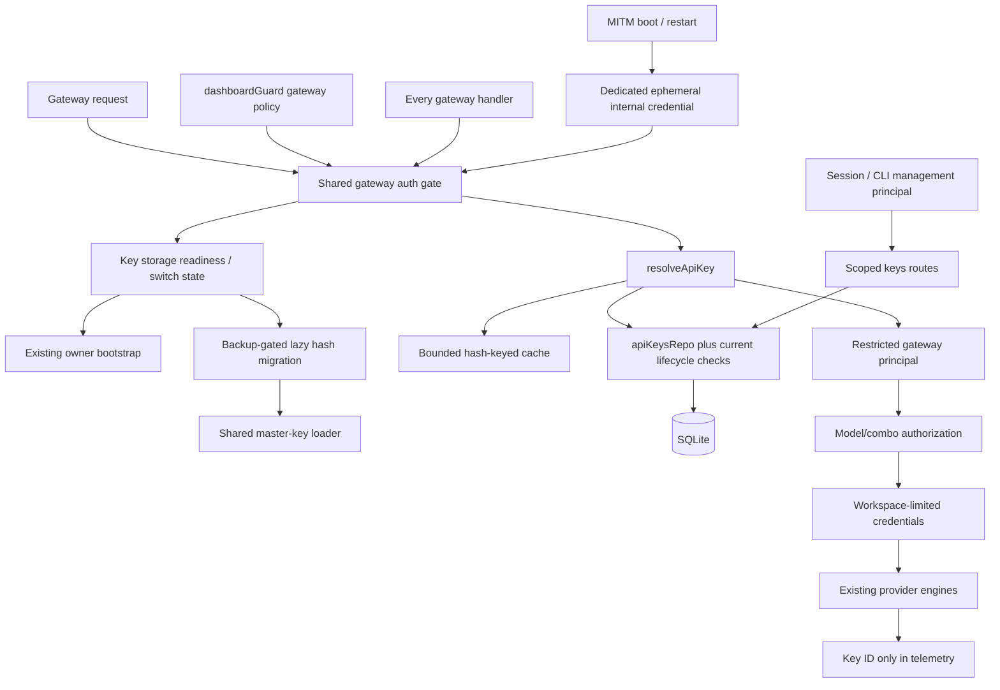

# Technical Research: YAN-363 — hashed workspace-scoped gateway API keys

## Executive Summary

Design grounded in worktree HEAD `bf80e10a` (YAN-361, PR #753), accepted `docs/users/spec.md`, ADRs 0001–0009, and GitHub #231. GitHub mirror omits binding YAN-350 amendment; live Linear YAN-363 includes it. Accepted ADR overrides old issue text: **HMAC-SHA256, not plain SHA-256; dedicated internal MITM credential, not a reference to an ordinary service-key row.** No new dependencies. Target `master`, v1.1.0; switch default stays off.

Main implementation risks: migration runner cannot conditionally skip an irreversible migration safely; schema auto-sync would resurrect a dropped raw `key` column; `resolvePrincipal` currently has no key branch; gateway credential selection remains global despite YAN-361; raw key consumers extend beyond `/api/keys`; turning switch off after hashing cannot restore old behavior. These need explicit contracts before parallel edits.

Recommended safety boundary: never-enabled installs preserve legacy behavior. Once hashing marker exists, switch-off refuses gateway and key-management operations with actionable 503 rather than reopening global routing or recreating raw storage. Re-enable switch or restore pre-enable backup. Dashboard login/recovery remains reachable. This is the safe implementation default for an ADR gap. Maintainer decision needed only to allow continued operation while off after migration.

## Architecture Design

### Source evidence

| Source                                                                  | Verified behavior / consequence                                                                                                                                                                                                                                                  |
| ----------------------------------------------------------------------- | -------------------------------------------------------------------------------------------------------------------------------------------------------------------------------------------------------------------------------------------------------------------------------- |
| `src/lib/db/repos/apiKeysRepo.js:1–79`                                  | Global raw-key CRUD; `validateApiKey` exact-matches `key`. No scopes, expiry, lifecycle, cache.                                                                                                                                                                                  |
| `src/lib/db/schema.js:81–91`                                            | `key TEXT UNIQUE NOT NULL`; `idx_ak_key`. Dropping key requires rebuild.                                                                                                                                                                                                         |
| `src/lib/db/migrate.js:123–159, 161+, 424–443`                          | Runner stamps every registered migration, even if its `up()` did nothing. Auto-sync recreates missing columns/indexes. Schema backup failure logs and continues; irreversible key migration must NOT copy this failure policy.                                                   |
| `src/lib/db/migrations/helpers.js`                                      | `rebuildTable` accepts declarative definition, performs row-copy/count checks and recreates indexes; caller manages FK mode/transaction. Custom copy SQL does not enforce equal row counts itself.                                                                               |
| `src/lib/users/bootstrap.js:105–150, 213+`                              | Lazy owner bootstrap, global promise, independent pre-bootstrap backup. Failure swallowed/retried. `multiUserActive()` means second active user or second shared workspace, switch on. No SSO-JIT test yet.                                                                      |
| `src/lib/users/session.js`                                              | Existing principal path: cookie, CLI owner, login-disabled owner. Key hook explicitly reserved. CLI checks direct loopback only with 2+ active users; uses 5s switch cache with fail-open-to-off on read errors. Do not reuse that cache for irreversible key storage decisions. |
| `src/lib/users/workspaceScope.js`                                       | `principalScope()` returns null with ≤1 active user even when switch on. Inappropriate for hashed-key ownership: multiple workspaces and service keys still need scope enforcement.                                                                                              |
| `src/lib/users/principal.js`                                            | Principal currently requires string `userId`; `can()` treats `gateway.use`/`self.session` as true for any non-pending instance role. API-key principals must not inherit management/session powers.                                                                              |
| `src/dashboardGuard.js:33–56, 113–118`                                  | Local request immediately admitted; API-key check boolean only. Guard gateway branch returns before capability resolution.                                                                                                                                                       |
| `src/lib/auth/requireClientApiKey.js`                                   | Conditional on `requireApiKey`; accepts `hasValidCliToken`, not peer-aware `cliTokenAccepted`.                                                                                                                                                                                   |
| `src/sse/handlers/chat.js:102–140`                                      | Separate key gate; ignores CLI token; trusted combo probe uses in-process `skipApiKeyCheck`. Auth must remain before synthetic warmup/naming response.                                                                                                                           |
| `src/sse/services/auth.js:65–131`                                       | `getProviderCredentials` globally selects `getProviderConnectionsUnscoped`; free/no-auth provider path returns before loading connections.                                                                                                                                       |
| `src/sse/services/model.js`                                             | Aliases/combos global; custom provider nodes loaded unscoped. YAN-364/368 not landed.                                                                                                                                                                                            |
| `src/app/api/v1beta/models/[...path]/route.js:209–225`                  | Gemini-native path has ninth independent key gate; converted-chat path reconstructs Request. Both must retain auth context.                                                                                                                                                      |
| `src/sse/handlers/videoGeneration.js:28–65`                             | GET/poll uses unscoped connection ID; multipart create may have no parsed model. Must not bypass scopes.                                                                                                                                                                         |
| `src/shared/services/initializeApp.js:212–216`                          | MITM boot uses first active raw key or `ACTIVE.defaultApiKey`.                                                                                                                                                                                                                   |
| `src/mitm/manager.js:457–500, 533+, 690–724`                            | Auto-restart captures raw key; spawn sends `ROUTER_API_KEY`; Unix sudo branch embeds env in shell command. Never log command/errors containing credential.                                                                                                                       |
| `src/mitm/handlers/base.js:8, 23–38`                                    | Reads `ROUTER_API_KEY`, forwards Bearer to router. Contrary to stale ADR prose, this file does not authenticate incoming client keys against it. No change needed to forwarding contract.                                                                                        |
| `src/lib/db/index.js:233–240, 290+, 379–393`                            | Export projects raw fields; import wipes/reinserts raw schema. Must adapt or reject before destructive work.                                                                                                                                                                     |
| `src/lib/db/repos/usageRepo.js:78–87, 174–180, 374–380, 520–521, 1290+` | Raw keys in history, daily map keys/meta, key joins. Hashing `apiKeys` alone does not remove stored client credentials.                                                                                                                                                          |
| `tests/setup/tenancyHarness.js`                                         | Existing `seedTenancy`, `callRoute`, `denied`. Next headers mocking pattern available in `tests/unit/connection-ownership.test.js`.                                                                                                                                              |

### Components and data flow



No generic auth framework, no AsyncLocalStorage requirement, no alternate persistence backend. Keep explicit request context threaded through existing handlers. Use process-global caches/promises only where Next proxy/route bundles otherwise duplicate module state; invalidate by adapter identity after DB reset/import.

### Core contracts

Proposed file names below are implementation contracts, not existing files:

```js
// src/lib/security/masterKey.js — no DB/barrel imports, safe against init cycles
loadMasterKey({ create = false } = {})
// Promise<{ kid: string, key: Buffer }> (32 bytes)
loadApiKeyHashKeys()
// Promise<Array<{ kid: string, key: Buffer }>>; current only now;
// retained kids added by YAN-377 before rotation is exposed

// src/lib/auth/apiKeyState.js
ensureApiKeyStorage()
// Promise<{ mode: "legacy" | "hashed", db }>; throws typed readiness error
// "hashed DB + switch off" never returns legacy.

// src/lib/auth/apiKeyPrincipal.js
resolveApiKey(presented)
// Promise<GatewayPrincipal|null>; invalid credential returns null;
// missing/corrupt master key and unavailable migration throw service errors.
invalidateApiKeyCache()
// Bounded immutable digest-to-ID cache; clear-all on mutations.
// Live eligibility/scopes read every request.

// src/lib/auth/gatewayAuth.js
resolveGatewayAuth(request)
// Promise<{ principal: GatewayPrincipal|null, legacy: boolean } | Response>
// Legacy null principal only before first enable.
authorizeGatewayTarget(principal, { modelId, comboId = null })
// null or OpenAI-shaped 403; canonical model ID required.

// Existing src/lib/auth/requireClientApiKey.js
requireClientApiKey(request)
// Preserve Response|null wrapper; delegates shared gate.
```

`GatewayPrincipal` combines gateway contract and existing principal shape:

```js
{
  userId: "user-uuid" /* null for service / internal MITM */,
  workspaceId: "workspace-uuid",
  activeWorkspaceId: "workspace-uuid",
  workspaceIds: ["workspace-uuid"],
  workspaceRoles: { "workspace-uuid": "member" },
  instanceRole: "user", // never inherit user's owner/admin privilege
  apiKeyId: "key-uuid", // null for local/CLI; stable internal sentinel for MITM
  scopes: { allowedModels: [], allowedCombos: [] },
  via: "apiKey" // "cli" or "local" for those paths
}
```

Update principal JSDoc to permit nullable `userId`. A service key is NOT owner impersonation. Existing `memberWorkspaceId(ctx, db, workspaceId)` requires a real membership and cannot serve service keys; use dedicated internal gateway-only row selection verified against the resolved key. Never invent an owner user ID to make that helper pass.

API-key principal gets **only `gateway.use` and workspace connection-use inside its one workspace**. `can()` explicitly rejects all other capabilities for `via: "apiKey"`. Management guard must still require session/CLI; attaching key branch to `resolvePrincipal` must not let `requireLogin=false` or a cookie fallback upgrade key privileges. Gateway chooses presented key ahead of dashboard cookie: key's workspace/scopes govern gateway even when browser also has owner cookie.

### Resolver, lifecycle and cache

1. Require valid storage state; use exact submitted bytes, no trimming or format re-interpretation. New format validation for creation only; previously stored legacy strings continue validating by hash, including pre-machine-ID keys.
2. Bound submitted token length before hashing (proposed ceiling 4096 bytes); compute candidate HMAC for each retained hash kid; indexed `keyHash` lookup. Never cache raw bearer values or log hashes/master key. Preserve issue cache with bounded positive immutable mapping `kid:digest` to `{ apiKeyId, hashKid, keyHash }`, TTL ≤5s; no negative cache. Cache is identity lookup optimization, never authorization authority.
3. On EVERY request, including cache hits, perform live indexed eligibility read joining key to workspace and, for user keys, user/current membership. Match cached hash identity against current row to prevent ID reuse after import. Read `isActive`, expiry, workspace, user, membership role and scopes live; mutable fields never served from cache. Require active key, `expiresAt > now`, existing workspace, active/non-pending user and connection-use membership. Do not use session cache for this read. Fail closed on malformed scopes.
4. Disable/leave semantics are permanent revocation, not temporary masking: DELETE affected user-key rows in same transaction as disable/membership removal; re-enabling user, rejoining or PUT isActive cannot revive deleted keys. Disable deletes every key with that userId; leave deletes only that user's keys in departed workspace. User deletion cascades user keys. Service keys retain null user and survive member churn; creator deletion only nulls createdByUserId. Workspace deletion cascades all its keys. Existing isActive toggle remains reversible manual pause only, not lifecycle revocation. Deletion avoids adding a revocation column/state machine; usage IDs remain historical attribution.
5. Clear identity cache synchronously after key mutation, lifecycle mutation, membership role change, workspace delete and DB import/reset. Live eligibility means cache TTL never delays revocation after committed DB mutation. Hypothetical processes sharing coherent native SQLite observe committed revocation on next read; sql.js independent-process writers remain unsupported. Requests authorized before concurrent revocation are not retroactively cancelled.
6. `lastUsedAt`: update accepted gateway request, not management list or every proxy lookup. Throttle by conditional SQL to once per key per 60s; first accepted use writes immediately. Timestamp is approximate activity, not usage accounting. No full telemetry framework.

### Gateway coverage and policy

Shared gate must run inside handlers, not merely proxy: handlers called directly by tests/probes, and Request reconstruction can lose context. `requireApiKey=false` never causes a presented invalid/expired/revoked key to fall back to owner in hashed mode.

| Entry / variant                                                                               | Integration                                                                                                                                                                                                              |
| --------------------------------------------------------------------------------------------- | ------------------------------------------------------------------------------------------------------------------------------------------------------------------------------------------------------------------------ |
| Chat, messages, responses, compact, Ollama compatibility (`src/app/api/v1/api/chat/route.js`) | `handleChat`; thread principal through single-model, nested combo, fusion generation/judge, fallback, capacity-adapter paths.                                                                                            |
| Embeddings                                                                                    | `src/sse/handlers/embeddings.js`; canonical model check before credentials; ID-only usage.                                                                                                                               |
| Images                                                                                        | `imageGeneration.js`; authorization before credential/provider call.                                                                                                                                                     |
| TTS / STT                                                                                     | `tts.js`, `stt.js`; include multipart/default model normalization.                                                                                                                                                       |
| Search / fetch                                                                                | `search.js`, `fetch.js`; defaults must resolve then pass scope check.                                                                                                                                                    |
| Video POST / GET / content                                                                    | `videoGeneration.js`; key gate for every method, pinned connection workspace verification, no scoped-model bypass for opaque multipart/poll requests. Reject with 403 when requested model cannot be established safely. |
| Gemini-native + converted generation                                                          | `src/app/api/v1beta/models/[...path]/route.js`; remove local validator; URL model/action normalized then authorized. Preserve query-key extraction before reconstructing requests.                                       |
| Model list/root/detail/info                                                                   | `src/app/api/v1/models/route.js`, `[...model]/route.js`, `info/route.js`, `src/app/api/v1/route.js` re-export; filter before returning, before upstream catalog credentials selected.                                    |
| Gemini catalog                                                                                | `src/app/api/v1beta/models/route.js`; same principal/catalog filter.                                                                                                                                                     |
| Token count / voices                                                                          | `src/app/api/v1/messages/count_tokens/route.js`, `audio/voices/route.js`; shared gate, scope check when model/provider relevant.                                                                                         |
| `/codex`, `/responses` rewrites                                                               | Verify `next.config.mjs` rewrite targets and exercise through HTTP; do not assume only `/v1` tests cover them.                                                                                                           |
| Internal combo probe                                                                          | Keep bypass exclusively in in-process argument, never header/body. Pass explicit authenticated probe principal in hashed mode. Bare `skipApiKeyCheck:true` cannot grant all-workspace routing.                           |

Minimum workspace-routing safety belongs here even though full routing is YAN-368: `getProviderCredentials(..., { principal })` restricts connection candidates by `principal.workspaceId` before any selection, preferred ID, refresh, or retry. Reject cross-workspace custom node and video connection IDs. No global fallback when workspace has no candidates. No-auth virtual connections still pass key scopes. Use narrow `*Unscoped` internal gateway repo functions that validate key principal, not public CRUD bypasses.

YAN-364 has not scoped combos/aliases/custom-model KV. Until it lands, treat existing global combos/aliases as Default-only; non-Default keys must not resolve them. Direct canonical provider/model requests can work in any workspace with owned connections. Scope expansion/grants and per-workspace fairness/rotation refactor stay with YAN-368/369, but no cross-workspace credential leak can be deferred.

Scope rules: empty array = unrestricted; nonempty `allowedModels` constrains canonical final leaf model IDs, nonempty `allowedCombos` constrains selected combo IDs. Both dimensions intersect for a combo. Check nested combo IDs and every leaf, fallback alternative, fusion participant/judge, capacity-adapter-added model. Direct model calls still obey `allowedModels`; `allowedCombos` does not grant direct model access beyond it. Exact matching only, no glob language. Block disallowed requested target with 403 before upstream work; never let 403 become fallback permission to broader scope.

**Keyless policy:** before enable preserve existing behavior. In hashed mode, accepted CLI token resolves owner + Default through `cliTokenAccepted`, never `hasValidCliToken` alone. Missing key accepted only when `requireApiKey=false` AND verified direct-local request AND (`multiUserActive=false` OR instance admin explicitly enabled proposed `allowLocalWithoutApiKey=true`). Origin and trusted-peer checks match existing `isLocalRequest`; move helper to low-level auth module if needed to avoid importing guard into auth. No remote keyless, proxy-local shortcut, session-cookie shortcut, or guessed Host permission. Presented invalid key always 401. Local principal attribution is owner+Default, not `local-no-key`.

`multiUserActive()` currently excludes SSO JIT; use its real predicate now and document later JIT extension. Also close CLI-only peer policy gap for second shared workspace without second user: use active predicate consistently rather than silently maintaining a more permissive parallel check.

## Data Models

### Final hashed table

Illustrative final DDL; same definition represented in current schema metadata and frozen migration definition:

```sql
CREATE TABLE apiKeys (
  id TEXT PRIMARY KEY,
  workspaceId TEXT NOT NULL REFERENCES workspaces(id) ON DELETE CASCADE,
  userId TEXT REFERENCES users(id) ON DELETE CASCADE,
  createdByUserId TEXT REFERENCES users(id) ON DELETE SET NULL,
  keyHash TEXT NOT NULL UNIQUE,
  hashKid TEXT NOT NULL,
  prefix TEXT NOT NULL,
  legacy INTEGER NOT NULL DEFAULT 0 CHECK (legacy IN (0, 1)),
  name TEXT,
  machineId TEXT,
  isActive INTEGER NOT NULL DEFAULT 1 CHECK (isActive IN (0, 1)),
  allowedModels TEXT NOT NULL DEFAULT '[]',
  allowedCombos TEXT NOT NULL DEFAULT '[]',
  expiresAt TEXT,
  lastUsedAt TEXT,
  createdAt TEXT NOT NULL
);
CREATE INDEX idx_ak_ws ON apiKeys(workspaceId);
CREATE INDEX idx_ak_user_ws ON apiKeys(userId, workspaceId);
CREATE INDEX idx_ak_hash_kid ON apiKeys(hashKid);
```

`keyHash` unique constraint supplies lookup index; no redundant same-column index. `allowedModels`/`allowedCombos`: validated JSON string arrays, default `[]`; do not silently coerce corrupt JSON to unrestricted. Expiry/usage timestamps UTC ISO strings, null allowed. `createdByUserId` records creator, never governs service lifetime. **Omit `budgetId` entirely in YAN-363**: issue explicitly says it is added later; future budget issue owns column, FK, API and enforcement. `machineId` only preserved for legacy rows. `prefix = key.slice(0,7) + "…" + key.slice(-4)`; obey literal first-seven rule, not inconsistent illustrative count in ADR.

No `ON DELETE SET NULL` on `userId`: that would convert a deleted user's key into surviving service key.

### Lazy migration: separate schema preparation from irreversible data step

Existing version runner is synchronous and always stamps version. Do **not** add `if (!switchOn) return` to `006` and assume a later switch flip reruns it. Do **not** call featureSwitch/getAdapter from driver initialization; DB cycles/deadlock risk.

1. Add frozen `006-api-key-metadata.js` to ordinary migration chain. Prepare nullable metadata columns and indexes while keeping raw `key` schema. No master-key creation, hashing, ownership mutation or raw deletion here. Off-state list/write response stays byte-compatible. Record both transitional and final hashed definitions explicitly in `schema.js`; do not edit shipped migrations.
2. `ensureApiKeyStorage()` obtains adapter after normal initialization; reads `isMultiUserEnabled()` and durable `_meta.apiKeysHashedVersion` marker. Own global per-adapter single-flight promise; no module-level done flag surviving adapter replacement.
3. On first enable, await `ensureOwnerBootstrap()`, then verify owner/Default exist explicitly because bootstrap swallows errors. Load/create stable master key. Missing/corrupt configured key aborts. Existing hashed marker with absent key must NOT generate replacement key.
4. Take dedicated `backupDbLite` backup and require successful return; fail closed on error, leaving raw rows and marker unchanged. Backup label identifies key hashing. Backup may contain plaintext by necessity and must be protected/documented. Ordinary migration's best-effort backup is insufficient evidence.
5. Gather raw-to-ID map in memory only. In one synchronous adapter transaction, populate metadata/hash fields, assign every old row to Default with `userId=NULL`, preserve name/id/isActive/createdAt/machineId; rebuild to final definition dropping `key`; validate counts/FKs; stamp marker only with successful commit. Use runner-style FK OFF/ON outside transaction; restore ON in finally. No `await` inside adapter transaction.
6. Run physical cleanup after commit as supported (`secure_delete` for deleted pages and checkpoint/VACUUM considerations for native WAL; sql.js persistence explicitly verified). Migration cannot claim byte-level plaintext erasure from DROP alone. Preserve original backup; do not silently delete legacy `db.json`/old backups.
7. Startup schema sync detects marker/final shape and chooses final table definition, never recreating `key`/`idx_ak_key`. Restart/idempotence and missing-marker/schema-mismatch tests mandatory. Legacy JSON importer must not reinsert raw rows into final table.
8. Runtime settings switch-on and API-only cold boot both call same readiness gate. No reliance on dashboard render or instrumentation alone. Failure produces generic 503 plus safe operator-facing reason; never raw-key fallback.

**Three storage states:**

| State                      | Reads / writes / gateway                                                                                                                                                         |
| -------------------------- | -------------------------------------------------------------------------------------------------------------------------------------------------------------------------------- |
| Never enabled + switch off | Original raw repo behavior, raw list response, legacy MITM path. No root key file created.                                                                                       |
| Switch on + ready          | Hashed scoped behavior, creation-only plaintext, lifecycle/scopes enforced.                                                                                                      |
| Hashed marker + switch off | 503 `api_keys_require_multi_user`; no raw CRUD, no global validation fallback, no MITM legacy fallback, no import into old schema. Dashboard login/settings remain for recovery. |

Restore pre-enable backup is only rollback that restores raw key behavior. Turning off switch is not decryption. No automatic downgrade, no copying hashes into `key`, no accepting arbitrary strings because `requireApiKey=false`.

### Master key and hash kids

Binding source is ADR-0005/0008: `TOKENHOP_MASTER_KEY` base64 encoding exactly 32 bytes; otherwise `DATA_DIR/keys/master` containing 32 random bytes, mode 0600, directory 0700. Reuse resolved `DATA_DIR` from `src/lib/dataDir.js`, not separately calculated home path, `API_KEY_SECRET`, JWT secret, machine ID or static salt. Create only at enable, exclusive creation/race-safe read; reject invalid-length, unsafe path/file, empty key. No permissive base64 decode accepting malformed garbage. Fail closed on missing/wrong known kid; do not replace lost root automatically.

Derive hash key with Node crypto HKDF-SHA256, explicit empty salt and info UTF-8 `tokenhop/api-key-hash`, 32-byte output; HMAC-SHA256 UTF-8 submitted key to lowercase hex. Explicit salt choice fills ADR omission and requires fixed-vector test. Generate `th_` plus 32 base62 characters with randomBytes rejection sampling (accept bytes below 248, modulo 62), not Math.random or biased modulo-all-bytes.

Choose deterministic nonsecret kid as first 16 hex characters of SHA-256(root bytes); reject kid mismatch. Rows retain `hashKid`. No KEK rotation command or archive store in this issue; `loadApiKeyHashKeys()` returns current derived key only. YAN-377 must retain old derived keys and extend loader before changing root, then retire each only when no row references kid. Never claim hashes can be rehashed without plaintext. Unexpected kid fails closed with key-material-unavailable error, never fallback to unrelated root. Kid encoding and explicit empty HKDF salt are safe implementation choices, not details prescribed by ADR.

### Raw-material containment versus later usage/export work

Accepted ADR assigns full usage attribution/history migration to YAN-370 and complete portable export/import to YAN-375. Still, YAN-363 cannot keep writing submitted bearer tokens or leak existing ones via unrelated endpoints after enabling hashing.

Minimum bridge now:

- Pass explicit `apiKeyId`, never presented token, across hashed-mode handler/core telemetry boundary. Freeze bounded storage bridge: existing `usageHistory.apiKey` column and daily `meta.apiKey` carry nonsecret row ID in hashed mode, with `_meta.apiKeysHashedVersion` declaring semantics. History migration replaces prior raw values in same fields; joins/display use ID. No second usage schema or dual-write of plaintext. Entry writers receive `{ apiKeyId, workspaceId, userId }`; hashed-mode sink rejects token-shaped `apiKey` input rather than silently storing it. Local/CLI writes use owner/Default metadata and a nonsecret local attribution ID; historical `local-no-key` unchanged. YAN-370 later renames/adds attribution columns and expands modality accounting.
- During key migration rewrite known credential occurrences in structured history/daily fields (including daily object key and nested meta) using in-memory raw-to-ID map; preserve counts/costs. Unknown deleted-key raw strings require replacement with non-secret stable attribution ID, not retention. Preserve historical `local-no-key` sentinel per ADR; new keyless requests carry owner/Default context.
- Ensure request-details/stream events/console-log endpoints do not expose header/query credentials. Existing `maskSensitiveHeaders` masks Authorization, x-api-key, x-goog-api-key, cookies and token headers; do not pass raw request URL with `?key=` to log/error paths. Test actual observable outputs.
- Existing raw copies in `cliToolPresets`, CLI settings, old backup/legacy JSON are a separate retention boundary. Never claim “no raw bytes anywhere” while those remain. Stop returning persisted gateway secrets from such APIs in hashed mode; strip on portable export or refuse unsafe operation. Do not rewrite arbitrary upstream-provider secrets as if they were gateway keys.
- Full DB export hashed keys may include `keyHash`/kid for backup, never plaintext; regular APIs must not include hashes. Existing import must reject unsupported hashed/multi-workspace payload before wiping anything, or support narrow valid same-workspace/same-kid restore. Full cross-instance restore waits YAN-375. Legacy-key import into hashed storage must hash transactionally, never insert raw.

These are security prerequisites/minimal compatibility bridges, not delivery of YAN-370/374/375's broader product scope.

### Reconciled minimum contracts after recommendations review

Reviewed `research-recommendations.md` in full; rechecked preset route/repo, Codex readback and cleanup, Home key summary, streaming usage carriers. The following are **required now**, not optional follow-ups:

| Surface                       | Minimum safe decision                                                                                                                                                                                                                                                                                                                                                              | Explicit failure behavior                                                                                                                                                                                                                                                                                                                                                            |
| ----------------------------- | ---------------------------------------------------------------------------------------------------------------------------------------------------------------------------------------------------------------------------------------------------------------------------------------------------------------------------------------------------------------------------------- | ------------------------------------------------------------------------------------------------------------------------------------------------------------------------------------------------------------------------------------------------------------------------------------------------------------------------------------------------------------------------------------ |
| Usage history/daily maps/meta | Migrate gateway credential occurrences to stable IDs in the same key-migration transaction; include inactive keys and every chat response mode. Deleted-key history gets deterministic keyed pseudonym under a distinct HKDF/HMAC domain, never user/owner attribution or unkeyed low-entropy hash. New writes carry key ID only.                                                  | Malformed credential-bearing structured usage aborts migration rather than skipping a raw-secret row. Roll back all changes; refuse gateway/key operations with 503 until corrected.                                                                                                                                                                                                 |
| Key presets                   | Known local gateway values become ID references; block new raw API-key preset writes in hashed mode. Existing key presets return labels/IDs only, never credential values. Endpoint presets remain usable. Unknown external presets must not be indiscriminately deleted.                                                                                                          | A legacy credential whose local/external provenance cannot be established must not silently survive a claimed live-DB no-raw migration. Require explicit operator classification/removal before completing migration; backup protects original data. While blocked, no key-preset readback or export may return raw values. This is an enable-time blocker, not deferred acceptance. |
| Per-tool saved settings       | Persist selected key ID, not typed bearer. Accept explicitly typed/just-created credential for immediate client-file write only; do not save it to KV, return it from API, or keep it in browser storage. Scrub known local raw credential fields in legacy tool settings during migration.                                                                                        | Missing plaintext for selected ID: require paste/create, no first-key, prefix, placeholder or `ACTIVE.defaultApiKey` fallback. Ambiguous saved credential follows same enable blocker as presets.                                                                                                                                                                                    |
| Host-tool GET/config readback | Return installation/status/nonsecret model and endpoint metadata. In hashed mode omit `config`/credential fields entirely (`config: null`, `credentialReadbackAvailable: false`) where safe structured redaction is not already available. Apply same rule to every audited config-read route, not Codex alone. Never modify client files merely to redact response.               | Unparseable config still cannot be returned raw. Report safe status/error; do not echo parser input or secret-bearing command. POST write result must not echo generated config.                                                                                                                                                                                                     |
| Codex legacy cleanup          | Add internal `findApiKeyIdentityUnscoped(presented)` matching hash regardless of active/expiry/user status. This is ownership recognition only, never authentication or external endpoint.                                                                                                                                                                                         | Missing/corrupt hash key or no match means “do not delete auth.json entry.” Resolver rejection is not proof credential belongs elsewhere.                                                                                                                                                                                                                                            |
| DB export/import              | Preserve unmigrated off behavior. Until complete new-schema restore contract is proven, refuse full database export/import once enable/migration readiness is in progress or hashed marker exists. Safe settings/config export may continue only after removing internal secrets/presets. Direct `exportDb`/`importDb` functions enforce guard before reading/exporting or wiping. | Proposed 409 `database_transfer_unavailable_for_hashed_keys`; no partial export, no empty-key export, no destructive work. Physical backup/restore remains operator recovery path; YAN-375 adds portable functionality later.                                                                                                                                                        |
| Switched off after migration  | Durable marker/schema state overrides legacy branch selection across all credential consumers, not just key repo. Refuse gateway, API-key CRUD, MITM start/restart, credential preset/settings reads/writes, client secret readback and DB transfer.                                                                                                                               | 503 `api_keys_require_multi_user`; safe dashboard/login, status and nonsecret recovery controls remain. Never silently send off-mode raw responses or run old SQL.                                                                                                                                                                                                                   |
| Internal MITM forwarding      | `base.js` forwards env bearer; gateway must authenticate it separately. Include `x-api-key`/`x-goog-api-key` and CLI-token headers in strip list for forwarded client headers so client cannot change internal auth identity or inject privileged fallback.                                                                                                                        | Invalid/replaced internal bearer fails closed; no fallback to forwarded client key or local owner. Internal mode rejects nonlocal router URL.                                                                                                                                                                                                                                        |
| Internal model probes         | Pass authenticated caller principal in-process to handler, or refuse enabled-mode path if that scope cannot be preserved without unsafe self-auth.                                                                                                                                                                                                                                 | Do not replace missing first raw key with owner CLI token for arbitrary workspace callers. Explicit 403/503 beats scope escalation.                                                                                                                                                                                                                                                  |

DB transfer refusal is the smallest safe initial contract, replacing earlier “support or reject” ambiguity. Consumer guards must consider **enabled + not yet ready**, **hashed + on**, and **hashed + off**; they must not briefly return legacy secrets while lazy migration is pending. Safe metadata/status views can remain available without triggering credential readback.

Secret guarantee has explicit boundaries: known local client credential must be absent from live gateway DB fields and every non-creation response/log; pre-migration backups and intentional client credential files are unavoidable approved retention locations. No operator data is deleted silently. Ambiguous external credentials are not proof a migration succeeded: readiness stays blocked until resolved. This bounded safety work does not deliver provider encryption, general workspace settings, full usage accounting, remote member config export, or key rotation.

## API Design

### Keys management

Keep existing URLs and status families. Switch-off-before-enable preserves existing contract. Hashed responses `Cache-Control: no-store`; single metadata projection used by list, detail and update. No spread of DB row.

| Endpoint                          | Hashed-mode contract                                                                                                                  | Permission                                                                      |
| --------------------------------- | ------------------------------------------------------------------------------------------------------------------------------------- | ------------------------------------------------------------------------------- |
| `GET /api/keys?workspaceId=<id>`  | `{ keys: KeyMetadata[] }`; existing usage fields retained using ID joins. Optional `storage: "hashed"`, migration notice flag for UI. | `workspace.keys.manage` in selected workspace; not globally in Default.         |
| `POST /api/keys?workspaceId=<id>` | Body below; 201 `{ id, name, key, prefix, workspaceId, userId, ...metadata }`. `key` plaintext only here.                             | `workspace.keys.create`; service creation additionally `workspace.keys.manage`. |
| `GET /api/keys/[id]`              | `{ key: KeyMetadata }`; retain envelope key name but no `key.key`.                                                                    | Manage in row's workspace; cross-workspace 404.                                 |
| `PUT /api/keys/[id]`              | Whitelisted mutable name/isActive/scopes/expiry; `{ key: KeyMetadata }`. No owner/workspace/hash changes.                             | Manage in row's workspace.                                                      |
| `DELETE /api/keys/[id]`           | Existing success envelope; clears resolver cache immediately.                                                                         | Manage in row's workspace.                                                      |

```json
{
  "name": "build runner",
  "kind": "service",
  "allowedModels": ["openai/gpt-4o"],
  "allowedCombos": [],
  "expiresAt": "2026-12-31T23:59:59.000Z"
}
```

`kind` proposed API discriminator: omitted means user key for current session principal, `service` means null user. Do not accept arbitrary `userId`, `createdByUserId`, `key`, `prefix`, `hashKid`, `keyHash`, `budgetId` (unknown field; 400). Workspace only selector, checked against current DB membership; URL/body duplicate selectors should not disagree. Existing `validateKeyName` reused. Require boolean isActive, bounded arrays of nonempty bounded strings, unique normalized values, valid future UTC expiry or null. Reject malformed JSON, non-object body, invalid dates, unknown scope IDs where resolvable. Reactivation allowed only for existing manually paused rows whose user/membership remain eligible; lifecycle-revoked keys no longer exist.

Proposed metadata:

```json
{
  "id": "key-uuid",
  "name": "build runner",
  "prefix": "th_Abcd…Wxyz",
  "workspaceId": "workspace-uuid",
  "userId": null,
  "legacy": false,
  "isActive": true,
  "allowedModels": ["openai/gpt-4o"],
  "allowedCombos": [],
  "expiresAt": "2026-12-31T23:59:59.000Z",
  "lastUsedAt": null,
  "createdAt": "2026-10-03T00:00:00.000Z"
}
```

400 invalid input; 401 missing authentication; 403 capability/scope denied; 404 outside workspace or missing ID; 503 migration/key-material unavailable or switched-off hashed storage. Invalid/expired/revoked gateway credential shares generic 401 `Invalid API key`; do not disclose user disabled/workspace existence/hash kid to caller.

Route policy keys rows become `scoped(...)`. Avoid reusing `workspaceScope()` unchanged because its one-user bypass contradicts hashed ownership. Add key-specific selector in keys route/helper using `getPrincipal` and DB membership, enabled whenever storage is hashed.

Members can create own key but accepted matrix does not grant general key listing/revoke. Do not silently broaden GET/DELETE to every member. Minimal UI/CLI shows creation-only secret; manager-only list controls. Own-key self-management extension would require explicit product decision, not guessed privilege.

### MITM internal credential

Binding ADR replaces older “explicit service-key reference” wording. Implement **explicit internal service credential configuration**, not selectable first client key and not normal apiKeys row:

- Proposed settings: internal `mitmInternalKeyHash`, `mitmInternalHashKid`, `mitmWorkspaceId` (Default initially). Hide hash/kid from all settings/status/export APIs and reject mass-assignment through generic settings PATCH/import. Internal helper owns writes.
- Generate fresh credential for EVERY spawn: manual start, cold boot, crash restart and reconfigure. Stop/confirm old child before replacement. Persist new hash/kid/context only after spawn attempt is ready to receive it; retain raw only in parent call stack/child env; restart closure stores no raw token. Spawn failure revokes new hash; never fall back to old token, client key or brand default. Cached raw MITM credential is forbidden.
- Shared gateway resolver recognizes internal hash separately, validates enabled MITM state and verified direct-local peer, resolves restricted service principal to configured workspace; never management powers. No synthetic ordinary key row.
- Hash credential must be active before child sends traffic; failed start must not expose credential in error/log. Stop/reconfigure revokes internal credential when no child should use it. Parent restart with surviving child must stop it and spawn fresh; if old child cannot be stopped, report MITM unavailable rather than accepting orphan.
- Switch-on `POST /api/cli-tools/antigravity-mitm` no longer requires client `apiKey`; `initializeApp`, route start and manager restart share credential helper. Keep legacy behavior off-before-enable. `ACTIVE.defaultApiKey` cannot authenticate hashed mode.
- Existing configurable remote `mitmRouterBaseUrl` cannot accept local-only internal credential on another instance. In hashed mode reject nonlocal router base for internal mode with clear configuration error; remote gateway needs an explicitly supplied external credential outside this internal path, never sent local root-derived credential by default.

### Local-keyless opt-in

Proposed `allowLocalWithoutApiKey` boolean defaults false and is writable only with instance settings capability. Hide/ignore new setting while never-enabled/off. `requireApiKey=true` always overrides opt-in. Mutation does not create any key or widen remote access. Existing generic settings patch validation must explicitly validate this field and avoid accepting internal MITM fields.

## System Constraints

- Single-process Node/Bun + SQLite deployment. Existing adapter fallback chain retained. No new package, schema engine, session table or external secret store.
- DB operations synchronous inside `adapter.transaction`; crypto/fs prerequisites awaited outside transaction. sql.js only debounces persistence: force/verify durability boundary before advertising completed irreversible migration; do not confuse in-memory commit with on-disk completion.
- Keys ~190-bit random secrets. HMAC essential for ~31-bit legacy keys. Do not use bcrypt/argon2 on per-request gateway path.
- Master/retained hash keys absent from DB backups/export. Generated file and env deployment backup procedure must be documented. Filesystem-root compromise remains outside protection claim.
- DB-only leakage protection applies after migration, not pre-migration backups or provider secrets before YAN-365. Never assert whole DB has no plaintext secrets.
- 5s immutable-identity cache maximum; immediate same-process invalidation; live eligibility, scopes and expiry checked every hit; size cap/eviction prevents attacker-controlled memory growth. Request-level memoization only identity-based, not attacker-supplied header context.
- Authorization before model catalog upstream calls, billing/provider selection, SSE start, or no-auth virtual provider work. Error shape compatible with OpenAI clients.
- One process can generate one legacy-to-hashed migration at a time; no awaited gap after reading raw rows before transaction that permits concurrent writer to escape hashing. Root key creation uses filesystem exclusivity.
- Existing framework/libraries unchanged; this is codebase/business-logic design, not new SDK/API integration. No external dependency docs necessary for conclusions.

## Codebase Changes

### Files to create

| File                                            | Purpose                                                                              | Owner lane / priority |
| ----------------------------------------------- | ------------------------------------------------------------------------------------ | --------------------- |
| `src/lib/security/masterKey.js`                 | Shared master loader, kid/HKDF/retained-key contract reused by YAN-365.              | A — foundations       |
| `src/lib/db/migrations/006-api-key-metadata.js` | Frozen additive preparatory schema. Verify next version still 6 at rebase.           | A — foundations       |
| `src/lib/auth/apiKeyState.js`                   | Backup-gated lazy rebuild and three-state readiness; no code runs off-before-enable. | A — foundations       |
| `src/lib/auth/apiKeyPrincipal.js`               | Hash resolver, restricted principal, bounded cache and invalidation.                 | B — auth              |
| `src/lib/auth/gatewayAuth.js`                   | Shared request auth + scope authorization, no handler-specific duplicate checks.     | B — auth              |
| `src/lib/auth/mitmCredential.js`                | Internal credential generation/context/lookup; no ordinary key row.                  | E — MITM              |
| `tests/unit/hashed-api-keys.test.js`            | Crypto, migration, repo/lifecycle/isolation contracts.                               | V — validation        |
| `tests/unit/gateway-key-principal.test.js`      | All ingress/keyless/CLI/scopes/workspace candidates.                                 | V — validation        |
| `tests/unit/mitm-internal-key.test.js`          | Boot/restart/revoke, zero apiKeys, no leakage.                                       | V — validation        |

Naming can collapse helper files if final code stays small; keep ownership stable before coding. Do not create an interface/factory around a single implementation.

### Exact parallel ownership lanes

| Lane                                          | Exclusive files / interfaces owned                                                                                                                                                                                                                                                                                                                                                                                                                                                                                                                                                                                                                                                                                                                                                                | Depends on                                                     |
| --------------------------------------------- | ------------------------------------------------------------------------------------------------------------------------------------------------------------------------------------------------------------------------------------------------------------------------------------------------------------------------------------------------------------------------------------------------------------------------------------------------------------------------------------------------------------------------------------------------------------------------------------------------------------------------------------------------------------------------------------------------------------------------------------------------------------------------------------------------- | -------------------------------------------------------------- |
| **A: storage + crypto + lifecycle**           | `src/shared/utils/apiKey.js`; `src/lib/security/masterKey.js`; `src/lib/db/schema.js`; `src/lib/db/migrations/{006-api-key-metadata.js,index.js}`; `src/lib/db/migrate.js`; `src/lib/auth/apiKeyState.js`; `src/lib/db/repos/apiKeysRepo.js`; `src/lib/db/repos/{usersRepo,membershipsRepo,workspacesRepo}.js`; `src/lib/db/tenancy.js`; `src/lib/db/index.js`; `src/lib/localDb.js`; `src/models/index.js`. Owns typed readiness errors, raw compatibility wrappers, scoped CRUD, internal hash lookup, same-transaction lifecycle revocation. Owns narrow import/export safety because same barrel file.                                                                                                                                                                                        | Agreed metadata/resolver contract                              |
| **B: principal + policy**                     | `src/lib/auth/{apiKeyPrincipal,gatewayAuth,requireClientApiKey,clientApiKey,trustedPeer,routePolicy}.js`; `src/lib/users/{session,principal}.js`; `src/dashboardGuard.js`; proposed keyless setting edits in `src/lib/db/repos/settingsRepo.js` and `src/app/api/settings/route.js`. Owns auth precedence and status/error contracts.                                                                                                                                                                                                                                                                                                                                                                                                                                                             | A readiness/hash lookup; E internal credential lookup contract |
| **C: gateway integration**                    | `src/sse/handlers/{chat,embeddings,fetch,search,imageGeneration,videoGeneration,tts,stt}.js`; `src/sse/services/{auth,model,comboProbe}.js`; gateway-facing internal candidate helper in `src/lib/db/repos/connectionsRepo.js` and node lookup in `providerNodesRepo.js`; `src/app/api/v1beta/models/{route.js,[...path]/route.js}`; `src/app/api/v1/{models/route.js,models/[...model]/route.js,models/info/route.js,messages/count_tokens/route.js,audio/voices/route.js}`; `src/app/api/models/test/ping.js`. Update rewritten wrapper routes only if request/principal propagation requires it.                                                                                                                                                                                               | B gate/principal; A scoped row contract                        |
| **D: routes + dashboard + CLI**               | `src/app/api/keys/{route.js,[id]/route.js}`; `src/app/(dashboard)/dashboard/endpoint/{endpointLogic.js,EndpointPageClient.js,hooks/useApiKeys.js,components/ApiKeysCard.js}`; `src/app/(dashboard)/dashboard/home/KeysSummary.js`; `cli/src/cli/api/client.js`; `cli/src/cli/menus/apiKeys.js`; CLI key consumers `cli/src/cli/{terminalUI.js,menus/cliTools.js}`. Owns one-time reveal, metadata-only list/detail, workspace selection, capabilities, prefix labels, no copied prefix as key.                                                                                                                                                                                                                                                                                                    | A metadata/scoped CRUD; B route-policy agreed behavior         |
| **E: MITM + raw-key compatibility consumers** | `src/lib/auth/mitmCredential.js`; `src/shared/services/initializeApp.js`; `src/mitm/{manager.js,handlers/base.js}`; `src/app/api/cli-tools/antigravity-mitm/route.js`; `src/lib/settingsConfigDoc.js`; `src/lib/cliToolConfigs/shared.js`; `src/app/api/cli-tools/codex-settings/route.js`; `src/app/api/cli-tool-presets/route.js`; `src/app/api/cli-tool-settings/{route.js,[toolId]/route.js}`; `src/lib/db/repos/cliToolSettingsRepo.js`; `src/app/(dashboard)/dashboard/cli-tools/hooks/useSetupSettings.js` and necessary MITM/setup cards. Owns audited host-tool readback guards across `src/app/api/cli-tools/*/route.js` (C retains model probe, D retains CLI client). Owns secret setting denylist values; sends B exact names for generic PATCH protection (B edits settings route). | A crypto; B gateway internal branch                            |
| **F: telemetry containment**                  | `src/lib/db/repos/usageRepo.js`; `src/lib/db/repos/apiKeyUsageRepo.js` (raw-key grouped `getApiKeyUsage`, verified source); `open-sse/handlers/chatCore.js`; `open-sse/handlers/chatCore/{requestDetail,nonStreamingHandler,streamingHandler,sseToJsonHandler}.js`; `open-sse/utils/requestLogger.js`; `src/sse/utils/logger.js`. Owns ID-only telemetry contract, structured raw-history scrubbing helper consumed by A migration. Full YAN-370 attribution remains later.                                                                                                                                                                                                                                                                                                                       | A raw-to-ID migration callback; C passes ID/context            |
| **V: verification integration owner**         | New test files above; existing affected tests (`api-key-rename`, `api-key-usage`, `usage-apikey-stats`, `client-api-key`, `require-client-api-key`, `principal-sessions`, `dashboard-guard`, `route-policy`, `tenancy-guard`, `db-migration-chain`, `db-migration-framework`, `combo-probe-apikey-gate`, `owner-bootstrap`, `multi-user-switch`); `tests/setup/tenancyHarness.js` only if shared harness truly needs extension. Sole test-file owner avoids clashes.                                                                                                                                                                                                                                                                                                                              | Contract-first tests; all lanes for final gates                |

A/B circular integration avoided: A repo never imports session/gateway; cache module must have no repo imports if A lifecycle writers call invalidation. Export small no-dependency invalidation hook from resolver cache section or separate tiny module only if cycle cannot otherwise be avoided. B uses dynamic import of resolver in session hook if bundle initialization requires it; dynamic import is not substitute for clear dependency direction.

A owns shared barrel/schema/migration numbers; no other lane edits them. B owns settings route; E supplies names rather than concurrent edits. C owns handlers; F supplies usage argument contract rather than editing same files. D owns CLI client; E must coordinate any unrelated CLI-tool client changes. V owns all tests, receiving test requirements from lanes.

### Final bounded contracts after security review

`research-security.md` reviewed in full. This section fixes implementation choices where previous alternatives existed; it does not retroactively label those choices as maintainer-approved ADR text.

**Authority separation:** `resolveGatewayAuth(request)` handles public inference only, with strict precedence: if any supported client credential field is present, resolve that credential or return 401; never fall through to cookie, CLI or keyless. When no client key is presented, validate peer-aware CLI, then explicit local-keyless policy. Empty/malformed credential headers count as supplied invalid credentials in hashed mode. Dashboard cookies grant no public gateway shortcut. `resolvePrincipal(request)` remains management session/CLI authority by default; add explicit `{ gateway: true }` option or separate gateway-only hook calling resolver. `getPrincipal()` used by CRUD never opts into gateway authority. Both resolvers may reuse principal data types, not authorization decisions. API-key principal's `instanceRole: "user"` is only structural compatibility; `can()` special-cases `via: "apiKey"` to deny management/self-session powers. Internal MITM is nullable-user service identity in Default, not owner/admin impersonation. Security report's “owner+Default” means configured instance-owned context, not full owner capability grant.

**Permanent revocation:** lifecycle disable/leave deletes applicable user-key rows in same existing synchronous transaction; user deletion uses cascade. Delete is smaller and safer than reversible isActive lifecycle revocation. No new revokedAt state needed. Live key/user/workspace/membership/scopes read on every use; cache stores immutable hash-to-ID mapping only. Manual pause via isActive stays resumable. Tests must attempt explicit PUT reactivation after lifecycle change, not only rejoin.

**Owned candidates or explicit refusal:** every gateway path must prove workspace and target authorization before reaching existing global helper. Direct canonical models use workspace-filtered connection/node lookups. Default-only global combo/alias compatibility is acceptable only with every expanded candidate rechecked and no admin/session bypass; non-Default use returns 403 until scoped model storage lands. Native Gemini, opaque multipart video, video edit/extend/poll/content, dynamic catalogs and internal probes return 403 `gateway_scope_unavailable` when target/candidate ownership cannot be established. Service/database readiness failures return 503, not an empty successful result or global fallback. `getProviderCredentials` in hashed mode rejects missing principal; no caller may omit it accidentally and reach `getProviderConnectionsUnscoped`. Free-provider path still needs principal and model permission. No grant support, fairness refactor or broad YAN-368 work required.

**Durable transition state:** central storage-state read returns `legacy`, `pending`, `hashed` or `disabled-after-hash`; only legacy state permits old SQL/secret responses. `ensureApiKeyStorage` progresses pending via backup and atomic migration. In pending/disabled/error states credential-bearing consumers refuse with 503, even if separate session switch cache says off. Pure settings/login/health/status recovery surfaces can continue without revealing secrets. Marker/schema mismatch fails closed; explicit same-version disable never reintroduces raw column/global routing. Re-enable or restore pre-enable backup is recovery.

**ID-only sink now:** report's existing-column ID bridge is final minimal contract; no raw input reaches usage buffers/history/daily/meta on successful, streaming, converted, error or fallback paths. Migration scrubs those structured fields atomically; unknown/deleted keys receive keyed historical pseudonym. Block readiness on malformed credential-bearing data. Full usage attribution/encryption/preset tenancy stays later, but no acceptance-critical sink remains operational with raw gateway credentials.

**Fresh MITM per spawn:** one helper prepares new credential before each controlled child spawn, retires prior hash, installs new verifier state, and revokes it on failure. Manager restart callback calls helper anew, never captures token. Stop old process first, including surviving process after parent restart; failed stop means unavailable. Only direct-local gateway accepts token, one Default workspace, no dashboard authority. base.js strips client credential/CLI headers and forwards only new env bearer. No remote router internal mode. Generation/verification contracts use same master/HKDF rules; token not in apiKeys.

**Budget scope:** no budgetId column, API, migration placeholder or enforcement. Latest task instruction and issue's explicit “added later” determine bounded work despite ADR's future table overview.

| Decision class                                                     | Already settled versus chosen now                                                                                                                                                                                                                                                                                                |
| ------------------------------------------------------------------ | -------------------------------------------------------------------------------------------------------------------------------------------------------------------------------------------------------------------------------------------------------------------------------------------------------------------------------- |
| Binding approved design                                            | th_ +32 base62; HMAC/HKDF with shared master; file/env root and 0600; Default legacy service keys; null user service lifetime; creation-only reveal; switch-on after backup; internal MITM credential; preserve legacy off-before-enable.                                                                                        |
| Explicit current task instruction                                  | Omit budgetId; fresh token each MITM spawn; immediate ID-only usage; preserve short cache through immutable identity mapping plus live eligibility.                                                                                                                                                                              |
| Safe implementation choices, not new maintainer policy             | Delete user keys for permanent lifecycle revoke; bounded metadata cache; canonical exact scope IDs; same-column ID telemetry bridge; 503 migrated-off mode; reject unsupported scoped inference; metadata-only config readback; refuse enabled full DB transfer. Each covered by named test, documented limitation and recovery. |
| Maintainer/product decisions still needed only to broaden behavior | Permit secure continued operation while switch off after migration; remote MITM internal/external mode; member self-list/revoke; non-Default combos before YAN-364; portable hashed DB transfer before YAN-375. Until decided, use refusals above rather than leak or infer privilege.                                           |

Do not introduce hash-key archive machinery beyond shared loader contract if no rotation exists yet: current kid derives from current root; unexpected kid fails closed. Record stable empty HKDF salt/kid encoding in tests. YAN-377 must add secure retained-kid loading before exposing rotation; never claim changing master key works today. This narrows earlier archive proposal and avoids an unrequested key vault.

### Build sequence

1. Freeze storage states, principal/metadata signatures, scope semantics, MITM internal contract and lane ownership. V writes failing fixture/isolation/HTTP contract tests first.
2. A adds key generation/master loading, additive schema, strict lazy readiness/rebuild, scoped repository and lifecycle revocation. Verify restart and off-state behavior before integration.
3. B adds resolver, capability restriction, keyless/CLI policy, shared guard/wrapper. E builds MITM helper in parallel once crypto contract exists. F builds ID-only telemetry migration bridge.
4. C replaces all inline gateway gates and constrains candidate/model access; D scopes routes and updates metadata-only dashboard/CLI. These lanes work in parallel only after B contract fixed.
5. A integrates F scrubbing callback into same migration; B integrates E internal lookup; D/E remove unsafe raw-key consumers; V runs adversarial endpoint inventory and safe import/export tests.
6. V runs complete isolated regression gate both switch states, lint/build/brand checks, temp-instance HTTP flows and browser checks. Review source for unowned gateway paths, secret returns and lifecycle cache holes.
7. Update feature/architecture/operator docs within agreed doc owner scope. No changelog, release/version/package dependency edits. This research lane itself writes only this report.

### Mandatory validation and evidence

Research validation performed: source trace and issue/ADR reconciliation only; no product tests run, no implementation pass claimed. Implementation validation owner must leave command outputs and observed response/DB assertions, not merely checklist ticks.

**Storage/crypto:**

- New key matches `^th_[A-Za-z0-9]{32}$`; generation uses crypto/rejection sampling; HMAC/HKDF fixed vector; literal prefix rule; no Math.random path in new format.
- Master env correct/invalid base64, lengths 31/32/33, absent file first enable, mode/parent permissions, concurrent exclusive creation, restart stability, missing/wrong existing kid, no file creation off.
- Existing `tests/fixtures/db/v1.0.0.sql` key authenticates before/after migration, IDs/names/inactive state/row counts preserved, Default service scope, no raw key column or value in live key rows.
- Normal boot off never hashes. Stored-switch runtime enable triggers migration. Failure at backup, master load, insert, rebuild, FK check, persistence leaves safe state; retry idempotent. Parallel first requests cannot duplicate/miss rows.
- Restart sync never recreates raw column/index. Test migrated DB with switch off returns 503 and does not create raw keys; re-enable restores validation. Restore pre-enable backup recovers legacy behavior in isolated fixture.
- Native SQLite and sql.js exercise rebuild/FK/persistence where available; logical row absence versus live-file/WAL byte absence tested separately. Backup intentionally still raw and restoreable.

**Lifecycle/isolation/capabilities:**

- Two-user harness: B cannot list/get/update/delete A key; query/body workspace spoofing rejected; DB membership rechecked even with forged/stale principal arrays.
- Member creates own user key, cannot create service key or another user's key; viewer/pending denied. Manager can manage own workspace metadata, not A personal workspace. API key never authenticates management routes, even service key or owner-created key.
- User disable/delete/leave deletes applicable user keys immediately with warm identity cache. Re-enable/rejoin and explicit PUT isActive cannot resurrect; deleted key returns 404. Manual pause of retained key can resume. User role downgrade to viewer blocks use via live check. Service key survives same lifecycle mutations. Workspace deletion invalidates/deletes all keys.
- Expiry exactly at now rejects, including cached key expiring before TTL. Mutation invalidation shared between separately imported proxy/route modules. Adapter reset/import cannot retain old positive cache.
- Stolen bearer key inherently authorizes its own scope: “B cannot use A key” means B cannot retrieve/mutate it or select B scope using it; bearer keys cannot identify thief holding exact valid secret. Test no workspace override, not impossible holder-identity binding.

**Gateway matrix:**

- Every entry above: missing/invalid/revoked/expired key; valid key; accepted local CLI token; remote CLI rejected when active; keyless local allowed only specified policy. Both requireApiKey states tested. Header precedence: Bearer, x-api-key, x-goog-api-key, query `key`.
- Invalid key plus owner cookie/local/CLI cannot silently broaden scope under chosen precedence. Remote/forwarded/forged trusted-peer/Host/Origin cases tested against `custom-server.js` path, not mocked Host alone.
- Key A cannot select B connection during normal call, retry, preferred-ID path, custom node, Gemini-native, video poll/content, catalog upstream lookup. Empty A workspace yields no candidates, never B fallback. No-auth providers still scope-checked.
- Canonical model aliases, `[1m]` marker, nested combos, fallback, fusion/judge, capacity adapters, model-less media defaults and multipart video obey scopes. Authorization failure causes zero upstream calls.
- Count-tokens/voices/list/detail/info/root routes follow same policy; OPTIONS retains deliberate CORS contract. Cold `/v1` boot without dashboard works.
- Combo probe bypass remains unforgeable from HTTP and scoped to requesting principal. Regression `combo-probe-apikey-gate.test.js` stays covered. `models/test/ping.js` uses accepted internal auth without rereading first raw key.

**Leakage/compatibility:**

- Actual POST response contains raw once; subsequent GET/detail/PUT never raw/hash/hashKid; every key response no-store. Capture console, request logs, API errors, SSE details and URL query path with sentinel secret; none contain secret. Avoid assertions limited to object field names.
- Usage history/daily map/meta preserve counts/costs but no known submitted raw key after bridge. New request records ID; keyless attribution owner/Default. YAN-370 follow-up explicitly covers full attribution schema and all modality usage.
- Raw legacy client token in presets/settings cannot leak through general list/export route, including migration-pending and hashed-then-off states. Known tokens become ID references; ambiguous external provenance blocks readiness without silently deleting data. Raw preset writes rejected, endpoint presets preserved, every host-tool readback audited. Master/derived key/internal MITM credential never in any regular response or logger.
- Import reject occurs before wipe; malformed/unsupported hashed backup leaves DB byte/logically unchanged. Legacy export/import with switch never enabled remains baseline behavior.
- CLI list/action paths display prefix, never `undefined` or copy prefix as credential; creation copy works once. UI reveal kept in transient memory, clears on dismiss/unmount/reload; migration notice acknowledged once without persisting raw secret.
- MITM with zero apiKeys starts/restarts using internal credential; no first-key/default fallback; internal credential only direct local gateway, correct workspace, no management powers; stop/rotation/parent restart invalidate old values; remote router URL fails safely.

Run from worktree:

```bash
TOKENHOP_MULTI_USER=off npm test
TOKENHOP_MULTI_USER=on npm test
npm run lint
npm run build
npm run lint:brand
# Focused tests only with isolation config:
npx vitest run -c tests/vitest.config.js tests/unit/hashed-api-keys.test.js tests/unit/gateway-key-principal.test.js tests/unit/mitm-internal-key.test.js
```

Never run alternate Vitest configuration: tests otherwise risk real HOME data. Use isolated temp DATA_DIR for running HTTP instance; exercise both switch states plus on-then-off, browser dark/light, 1440/1024/390 widths, keyboard and RTL for changed key surfaces. Never touch production data or enable real MITM/DNS during tests; stub spawn and test gateway with isolated HTTP fixture.

## Technical Decisions

| Topic                 | Options                                                       | Recommendation / rationale                                                                                                                                                |
| --------------------- | ------------------------------------------------------------- | ------------------------------------------------------------------------------------------------------------------------------------------------------------------------- |
| Hash                  | SHA-256 / slow password KDF / keyed HMAC                      | Binding ADR: HMAC with HKDF-derived master key. Legacy entropy makes unkeyed digest inadequate.                                                                           |
| Root key              | Existing API_KEY_SECRET/JWT/machine salt / new master loader  | Binding ADR: env or 0600 `DATA_DIR/keys/master`, shared with encryption issue.                                                                                            |
| MITM                  | First client key / ordinary service row / internal credential | Binding ADR: internal credential, never ordinary apiKeys row. Live Linear amendment confirms old GH wording superseded.                                                   |
| Conditional migration | Conditional numbered `up()` / lazy data migration marker      | Additive numbered prep + separate backup-gated lazy rebuild. Avoid skipped-and-stamped irreversible step.                                                                 |
| Off after hashing     | Recreate raw / global hash validation / fail closed           | 503 on key/gateway operations; explicit re-enable/restore recovery. No silent tenancy downgrade. Safe default; broader continued-off operation needs maintainer decision. |
| Principal storage     | API key impersonates owner / restricted gateway principal     | Restricted nullable-user principal; avoids service-key privilege escalation.                                                                                              |
| Lifecycle             | Check only at lookup / persistent revoke plus lookup checks   | Transactional revoke/delete + immediate cache invalidation, current user/membership validation. No resurrection.                                                          |
| Gateway scope         | Resolve principal only / safe owned candidates now            | Require minimum workspace candidate filter now; full grants/rotation remains YAN-368/369. Merely returning workspaceId is not isolation.                                  |
| Scopes                | Wildcards/free text / canonical IDs and exact lists           | Canonical provider/model IDs and combo IDs; intersection for combo leaves. No speculative glob grammar.                                                                   |
| Hash cache            | Raw Map / authorization cache / immutable identity cache      | Bounded digest-to-ID Map TTL≤5s plus live joined eligibility/scopes read on every request. No revocation staleness due to cache.                                          |
| Key lists             | Raw/masked raw / explicit metadata                            | Prefix only; raw shown once. No keyHash/hashKid in user APIs.                                                                                                             |
| Telemetry             | Defer all / full YAN-370 / minimal containment bridge         | Stop new raw writes and scrub structured existing key occurrences now, avoid implementing broad usage/budget project.                                                     |
| UI                    | New key-management redesign / adapt existing hook/card        | Existing `useApiKeys` already stores creation reveal separately; adapt minimal fields/capabilities/notice.                                                                |
| Export/import         | Pretend old import works / scoped safety boundary             | Narrow support or fail before mutation; do not ship wipe-then-raw-insert against dropped column.                                                                          |

## Open Questions

1. **Maintainer decision only to broaden off-after-hashing behavior:** implementation uses durable fail-closed 503 now. Any secure continued-off mode needs explicit approval and tests; never infer global compatibility.
2. **Scope ID contract:** report recommends combo row IDs, canonical provider/model IDs, intersected restrictions. Issue/ADR names fields but do not prescribe list item encoding or nested combo semantics. Freeze before route/UI/gateway lanes diverge.
3. **Raw containment decision fixed for implementation:** bounded usage/preset cleanup, credential readback removal and transfer guards are mandatory here. Broader YAN-370/374 work remains later. Orchestrator must accept explicit enable-time blocker for ambiguous external preset provenance; never defer existing credential leaks. Record backup/client-file retention boundaries and test live sinks.
4. **Unmigrated global models:** report recommends Default-only combos/aliases until YAN-364, plus direct scoped models elsewhere. If feature requires arbitrary workspace combos now, that pulls YAN-364 scope forward and must be agreed explicitly.
5. **Member own-key management:** accepted capability matrix grants create, not list/revoke. Keep existing manager-only policy unless explicit self-management decision made.
6. **Future retained-kid storage:** no archive machinery now. Current kid = first 16 hex SHA-256(root); HKDF empty salt explicit, tested and documented for YAN-365/377. YAN-377 chooses archive persistence and must support old kids before rotation. Unexpected kid currently fails closed.
7. **Remote MITM router:** internal credential only valid locally. Existing arbitrary router-base feature needs explicit refusal/internal-versus-external mode decision, never silent credential reuse.

No unresolved question about hash algorithm, master-key source, default-off switch, or first-active-key MITM removal: accepted decisions already settle those.
