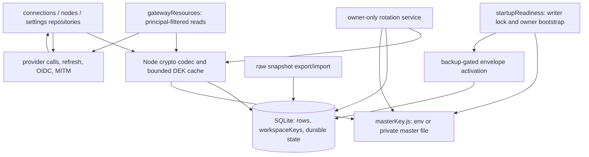

# YAN-365 — Technical research

## Executive Summary

Research baseline: worktree HEAD `896a77f7`; GH #233 full body/comments (no comments), `CLAUDE.md`, `docs/ARCHITECTURE.md`, main-checkout `docs/users/README.md`, `spec.md`, accepted `adr/0008-encryption-at-rest.md`. Issue mirror predates approved ADR; code inventory supersedes stale handbook paths. Research only. Parent owns validation; no app changes or test execution here.

Minimum design: reuse `src/lib/security/masterKey.js`, existing exclusive DATA_DIR writer lock, synchronous adapter transactions, startup readiness latch, protected backup helpers, scoped repositories and raw snapshot helpers. Add one strict AES-256-GCM codec, one workspace-key/storage helper, one switch-on activation helper, one rotation service. No dependency, executor crypto, new DB engine or async crypto inside transactions.

Critical findings:

- **Requirement (decided): KEK rotation preserves gateway API-key hash key.** YAN-363 `deriveApiKeyHashKey(master)` derives HMAC key from same master KEK. Persisted hashes cannot be recomputed without raw keys, which YAN-363 intentionally destroyed. Rotation therefore persists existing derived hash key wrapped under KEK and rewraps it under new KEK with DEKs; every hash caller reads that stable key. Without it, every gateway key breaks.
- **Requirement (decided): Default workspace undeletable while holding SSO/MITM secrets; Default DEK rotation re-encrypts instance secrets.**
- **Requirement (decided): AAD = `table|rowId|workspaceId|field`.** Stronger than ADR-0008 `connectionId|workspaceId`; record as approved clarification.
- **SQLite transaction cannot atomically replace filesystem key.** Use staged durable key + durable DB commit marker + restart recovery. File rename alone, transaction alone, or best-effort shutdown flush loses credentials on crash.
- **Existing raw gateway queries bypass repositories.** `src/lib/auth/gatewayResources.js:39-71` decodes JSON directly. Must use same decrypt codec after principal/workspace SQL filtering.
- **Switch off after activation must retain encryption and security.** Durable marker governs storage; rollout switch governs first activation and new route visibility. Never decrypt persisted rows back to plaintext or regenerate missing master.
- **ADR backup crypto-shredding claim is false for complete old backups.** Old backup containing wrapped DEK plus available KEK can decrypt old ciphertext after live workspace deletion. Cache purge/live DEK removal prevents current-instance use, not recovery from copied historical key records.
- **Remaining ADR/issue conflicts.** ADR delegates CLI to YAN-377 and backup/transfer to YAN-375, and says process starts with unreadable connections after key loss. Issue specifies CLI/admin rotation, transfer coverage and missing-key fail-fast. Parent must record resolutions before coding; current startup already refuses missing KEK for hashed gateway keys. AAD conflict resolved above.

## Architecture Design

### Components and boundaries



Crypto helpers accept adapter/context/key explicitly. No DB barrel, feature-switch, session or startup-readiness import inside synchronous codec/storage helpers. Those imports create cycles: `featureSwitch.isMultiUserEnabled()` currently calls `getSettings()`, and owner bootstrap also consumes settings.

Resolve rollout once in `src/lib/db/startupReadiness.js:26-47`, after adapter migrations. Existing order: writer lock, adapter/schema migration, switch resolution, strict owner/Default bootstrap, `activateGatewayKeys`, then timers/model sync/requests. Extend same latch with envelope activation; do not add independent initializer race.

Never-enabled + switch off: no master creation, encrypted values, workspace-key rows, encryption backup or activation marker. Additive empty schema may ship ungated. Existing hashed but not yet encrypted instance + switch off: validate existing root through gateway activation, skip envelope activation. Already-encrypted instance: validate root/state and initialize crypto regardless of rollout. Marker/schema mismatch or envelope without key state is corruption, not legacy mode.

### Activation protocol

1. Resolve owner and durable `_meta.defaultWorkspaceId`; require valid existing workspace. Adopt ownerless connection/node rows through existing `adoptOwnerlessRowsUnscoped` before encryption, never assign every already-owned row to Default.
2. Validate encryption storage state. If established, `loadMasterKey({ create: false, expectedKid })`; validate wrapped keys and covered envelopes. Missing/wrong root throws clear code before providers/background writers start. Never auto-create replacement root.
3. If first activation and rollout on, reuse root created by gateway-key activation. Load root before synchronous transaction. Create/validate private pre-encryption backup using `makeProtectedBackupDir` and `prepareProtectedBackupVerifier`; verify snapshot row counts/identity and secret digests, not merely nonempty bytes. Backup failure aborts before secret mutation.
4. In one synchronous transaction, create required DEKs, wrap current derived API-key hash key under KEK (hashed instances), encrypt connection/node secret leaves, migrate settings/legacy MITM secret, write complete version/root markers. Each workspace uses its own DEK; instance settings use Default. Generate nonce/encrypt synchronously; no awaited network/file work inside callback.
5. Force throwing persistence (`sql.js.flushSync`, native `synchronous=FULL` plus checked WAL checkpoint), then cleanse live plaintext remnants. Native checkpoint/TRUNCATE, secure-delete/rebuild or VACUUM as required; scan main DB, WAL and relevant sidecars. Freshly encrypted logical rows do not prove old plaintext pages gone.
6. Mark cleanup complete only after verified physical cleanup. Since VACUUM runs outside transaction, crash can leave committed ciphertext plus old free-page plaintext. Restart must finish cleanup before readiness. Retain protected pre-activation backup by explicit policy; it necessarily contains old plaintext. Do not claim whole DATA_DIR is secret-free.

Mixed reads are for initial pre-activation fixture/transaction handling, not permanent downgrade. Strict migration authenticates existing envelopes, preserves them unchanged, encrypts plaintext once, and rolls back all rows on malformed data. Established storage rejects plaintext secret writes and unexpected plaintext secret rows. A completed version marker is not sufficient if physical persistence or cleanup failed.

### Read/write and transaction integration

- Connections: codec at `rowToConn`, `connToRow`/`upsert`, retaining internal synchronous API. Async public wrappers prepare key material once before `db.transaction`. `createInTx` decrypts before OAuth dedup, `mergeReloginProviderData`, priority/relogin merge; only secret leaves change, metadata stays queryable. `updateInTx` decrypts current row, merges patch, encrypts before single SQL upsert. Preserve identity/workspace immutability and AAD from authoritative SQL row, never caller-supplied workspace.
- Existing transaction callbacks do **not** await: adapter wrappers release savepoints immediately when callbacks return Promise. No async `rowToConn`, async encrypt or async DEK creation inside transaction.
- Creating first DEK must share transaction with first credential write; avoid cached orphan key after rollback. Publish cache only after committed operation, or live-check wrapped row on every cache hit.
- Unchanged encrypted fields should retain original envelope where practical; metadata-only refresh/health writes need not regenerate every nonce. Never accept client-crafted envelope as plaintext-write bypass; envelopes enter only through authenticated storage/migration/import path.
- Gateway: `getGatewayConnections` and `getGatewayNodes` decode with codec after `requireGatewayWorkspace` and SQL filtering. Keep legacy path intact. Service API-key principal has no userId; do not route it through dashboard membership APIs.
- Management responses are not decrypt APIs. Keep internal plaintext reads for runtime, but remove all secret leaves from list/detail/create/update responses when security established, including rollout off after activation. `workspaceScope.redactConnection` currently strips only five nested keys; broader coverage needed. Metadata-only listing should not fail wholesale because unrelated secret is unreadable. Minimal raw metadata reader avoids decryption there; runtime credential reader throws on unreadability.

### Refresh mutation map

| Caller/path                                                                                               | Persisted patch                                                                                                | Integration requirement                                                                                                                                                                                             |
| --------------------------------------------------------------------------------------------------------- | -------------------------------------------------------------------------------------------------------------- | ------------------------------------------------------------------------------------------------------------------------------------------------------------------------------------------------------------------- |
| `src/sse/services/tokenRefresh.js:updateProviderCredentials`                                              | `accessToken`, `refreshToken`, `idToken`, `lastRefreshAt`, expiry, projectId, nested PSD, Copilot token/expiry | Keep repo merge/encrypt atomic. Current helper omits `apiKey` despite refresh success condition accepting it. Add covered-key persistence for minted provider API keys.                                             |
| `src/sse/services/tokenRefresh.js:checkAndRefreshToken`                                                   | proactive token pair; GitHub secondary Copilot exchange                                                        | Current helper catches writes and returns false; caller continues using refreshed memory regardless. Encryption/persistence failures must not be reported as durable success, especially single-use refresh tokens. |
| `src/sse/services/auth.js`; `src/sse/handlers/chat.js` callbacks                                          | on-request `onCredentialsRefreshed` patch                                                                      | Existing repo remains encryption seam; propagate integrity errors instead of auth fallback with empty key.                                                                                                          |
| `open-sse/handlers/chatCore.js`, executors, `open-sse/services/oauthCredentialManager.js`                 | executor 401/403 refresh output, provider-specific result shapes                                               | Keep engine plaintext-only and DB-independent; retain per-connection refresh lock. Review app persistence callback, not every executor.                                                                             |
| `src/app/api/providers/[id]/test/testUtils.js:1282-1301`                                                  | refreshed top-level tokens, expiry, merged PSD                                                                 | Same codec; add minted `apiKey` if returned. Existing merge assembles PSD outside transaction: do not replace current sibling secret fields from stale snapshot.                                                    |
| `src/lib/oauth/providers/index.js`                                                                        | onboarding/relogin, Codex metadata enrichment                                                                  | Repo dedup must see decrypted identity metadata, preserve omitted secret leaves correctly.                                                                                                                          |
| `src/app/api/oauth/xiaomi-mimo/api-key/route.js`                                                          | new `apiKey`, PSD `mimoPassToken`                                                                              | Keep both protected on updates as well as creates.                                                                                                                                                                  |
| `src/shared/services/quotaSnapshotPoller.js`, `quotaAutoPing.js`, `src/sse/services/quotaSnapshotSync.js` | mostly health/plan metadata through repo                                                                       | Do not overwrite encrypted secrets while writing metadata.                                                                                                                                                          |

Actual refresh code is `src/sse/services/backgroundTokenRefresh.js` (started from `src/shared/services/initializeApp.js`) and `open-sse/services/oauthCredentialManager.js`, not absent `src/shared/services/{backgroundTokenRefresh,oauthCredentialManager}.js` paths from old inventory.

### Settings, SSO and MITM

`settingsRepo.readRaw()` must remain raw for export/state lookup. Internal `getSettings()` returns decrypted covered fields; public settings route strips `SECRET_SETTING_KEYS`, as today. `updateSettings` merges raw storage and encrypts only supplied secret updates inside existing transaction. `updateComboStrategies`, `combosRepo` strategy helpers, users password mirroring and `gatewayKeyTransfer.preserveLocalVerifierSettings` must preserve raw envelopes unchanged when writing non-secret settings.

Feature-switch lookup cannot decrypt all settings before keys are initialized. Add narrow raw rollout-setting read used only by `featureSwitch.js`; keep sole switch ownership there. Do not import featureSwitch from crypto helpers. Bootstrap needs decrypted SSO only after root initialization on established encrypted storage; cold-start ordering must account for this.

SSO uses `src/lib/auth/oidc.js` and `/api/auth/oidc/test`; they expect secret strings and `.trim()`. `samlPrivateKey`, `samlDecryptionKey`, `samlSigningKey` appear in secret lists/ADR but current `src/lib/auth/saml.js` has no direct consumers for those named settings. Encrypt present values without inventing SAML configuration features.

MITM manager is CommonJS (`require`) with injected `initDbHooks`; avoid direct ESM crypto import. Current `encryptPassword` stores `ivHex:tagHex:ctHex`, using machine-id/static salt; `loadEncryptedPassword` decrypts that. Before activation, preserve behavior. After activation, injected settings/secret adapter stores sudo plaintext only through repo encryption and returns sudo plaintext for manager; remove double machine-encryption from activated path. Legacy migration strictly decrypts old string once; failure aborts or requires explicit operator re-entry, never silently discards stored sudo secret. Avoid importing entire manager during migration: top-level `ensureRuntimeServer` has runtime side effects. Extract only legacy crypto functions if needed.

Clear `globalThis.__mitmSudoPassword` when import/restore replaces Default key or settings. Default deletion is blocked while it holds secrets; Default DEK rotation leaves sudo plaintext unchanged. Existing `saveMitmSettings`/`loadEncryptedPassword` swallow failures; activated persistence/integrity errors need explicit failure handling, not `null` treated as no password.

### Workspace deletion and decrypt cache

`workspaceKeys.workspaceId REFERENCES workspaces(id) ON DELETE CASCADE` handles live DEK-row removal with connections/nodes. `workspacesRepo.deleteWorkspace` currently issues direct delete; `usersRepo.deleteUserUnscoped` separately deletes personal workspaces in transaction. Both must collect affected IDs, commit deletion, then clear workspace crypto cache synchronously. Also purge on import, DEK rotation and any replaced key records.

Default guard (requirement): inside delete transaction, read `_meta.defaultWorkspaceId` and raw settings; if target is Default and any covered instance secret (`oidcClientSecret`, `samlPrivateKey`, `samlDecryptionKey`, `samlSigningKey`, `mitmSudoEncrypted`) is non-empty, throw `TenancyError("DEFAULT_WORKSPACE_HOLDS_SECRETS")` (409) with zero mutation. Check and delete share one transaction so concurrent secret save cannot race. Current `deleteWorkspace` lacks any Default protection and does `getWorkspace` outside transaction; move delete into transaction. Personal-workspace path (`deleteUserUnscoped`) never touches Default (Default is `kind = 'shared'`), but assert anyway. Flag: startup (`requireOwnerAndDefault`) and owner bootstrap also require Default; even secret-free Default deletion bricks next restart. Recommend parent consider unconditional Default block; requirement minimum is secret-conditional.

Minimum bounded decrypt cache: cache unwrapped DEKs only, e.g. hard cap 128 entries plus TTL, keyed by adapter/DATA_FILE + workspaceId + DEK kid + wrapping generation. No decrypted credential-string cache. On hit verify workspace/key row still exists and wrapped value/generation matches; cache may not resurrect deleted key. Zero Buffer on eviction best effort. JS strings, in-flight provider credentials and old backups cannot be guaranteed erased. No unbounded per-file outer cache.

## Data Models

### Storage schema

Suggested additive migration `013-workspace-keys.js` (confirm next free version at implementation):

- `workspaceKeys`: `workspaceId TEXT PRIMARY KEY REFERENCES workspaces(id) ON DELETE CASCADE`, `kid TEXT NOT NULL`, `wrappedDek TEXT NOT NULL`, `createdAt TEXT NOT NULL`. One active DEK per workspace; rotate all that workspace's fields atomically. Historical DEK rows unnecessary unless explicit retained-version requirement approved.
- `_meta`: strict paired `credentialsEncryptedVersion = "1"`, `credentialsKekKid = masterKeyId(root)`, plus cleanup-required/completed state if physical cleanup spans transactions. Export/import transports encryption state explicitly, never trusts marker alone.
- Wrapped DEK envelope: `{v:1, kid:<DEK-id>, iv:<canonical base64 12 bytes>, ct:<canonical base64 32 bytes>, tag:<canonical base64 16 bytes>}`. Wrapping root ID lives in storage marker, not mixed with DEK kid. New DEK id from `randomBytes`/`randomUUID`, unrelated to root ID.
- Secret field value replaces original leaf with envelope object, serialized within existing JSON `data`. Preserve null/empty/missing semantics; do not encrypt metadata or whole PSD blob.

Use fixed AES-256-GCM, 32-byte keys, fresh 12-byte random nonce per encrypt/wrap, fixed 16-byte tag. Explicit algorithm/tag settings, strict version/kid/base64/length/type/size validation before allocation/decrypt. `setAAD` before update, `setAuthTag`, and return plaintext only after successful `final()`. Do not expose unauthenticated `decipher.update` bytes. Bound ciphertext size using existing route/import payload limits; agree explicit credential max size with parent security lane.

Field AAD (decided): `table|rowId|workspaceId|field`.

```text
connection top-level     providerConnections|<connId>|<wsId>|refreshToken
connection nested        providerConnections|<connId>|<wsId>|providerSpecificData.clientSecret
node                     providerNodes|<nodeId>|<wsId>|apiKey
instance setting         settings|1|<DefaultWsId>|oidcClientSecret
wrapped DEK              workspaceKeys|<wsId>|<wsId>|dek:<kid>       (extends ADR workspaceId|kid)
wrapped API-key hash key _meta|apiKeyHashKey|<DefaultWsId>|hashKid:<hashKid>
```

Encoding: reject any component containing `|` or control chars (IDs are UUIDs, fields from fixed allow-list, tables constant); otherwise throw. `workspaceId` from authoritative SQL row, never caller. Consequences: field binding stops swapping access/refresh token within one row; table binding stops connection/node/settings cross-moves. Rows without `workspaceId` (pre-bootstrap) cannot be encrypted, so activation adopts ownerless rows first and encrypt throws on NULL. Moving connection between workspaces (YAN-701) must decrypt and re-encrypt. Record as approved strengthening of ADR-0008.

### Exact covered credential shapes

| Storage path                                                                         | Current observed shape/source                                                                                                                        | Treatment                                                                                                                                                                                                                           |
| ------------------------------------------------------------------------------------ | ---------------------------------------------------------------------------------------------------------------------------------------------------- | ----------------------------------------------------------------------------------------------------------------------------------------------------------------------------------------------------------------------------------- |
| connection `accessToken`, `refreshToken`, `idToken`, `apiKey`                        | Strings; OPTIONAL_FIELDS in connectionsRepo. Cookie providers `grok-web`/`perplexity-web` store SSO/session cookie in `apiKey` (`authType: cookie`). | Encrypt leaves for every provider, not category-only.                                                                                                                                                                               |
| PSD `clientSecret`                                                                   | Kiro AWS client registration (`src/lib/oauth/providers/kiro.js`); needed by refresh                                                                  | Encrypt; `clientId`, `region`, `authMethod`, `profileArn` remain metadata.                                                                                                                                                          |
| PSD `copilotToken`                                                                   | GitHub secondary bearer, alongside numeric `copilotTokenExpiresAt`                                                                                   | Encrypt token only; top-level GitHub OAuth tokens separately protected.                                                                                                                                                             |
| PSD `idToken`                                                                        | xAI mapping and Grok CLI                                                                                                                             | Encrypt, including both nested/top-level copies when present.                                                                                                                                                                       |
| PSD `firebaseIdToken`                                                                | Windsurf mapping                                                                                                                                     | Encrypt.                                                                                                                                                                                                                            |
| PSD `mimoPassToken`                                                                  | Xiaomi MiMo onboarding/update                                                                                                                        | Encrypt; `uid`, `mimoUserId`, `mimoCUserId` metadata.                                                                                                                                                                               |
| PSD `cookie`                                                                         | iFlow cookie login, `src/app/api/oauth/iflow/cookie/route.js`                                                                                        | Encrypt complete cookie string, not extracted token substring.                                                                                                                                                                      |
| PSD `apiKey`, `secretAccessKey`, possible token aliases                              | Current `workspaceScope.PSD_SECRETS` names both; engine uses PSD `apiKey`/`accessKeyId` in some paths; old bulk imports accept arbitrary PSD         | Protect existing known credential aliases. Do not rely on registry: no universal `secretFields` registry exists. Conservative recursive credential-key policy plus explicit provider-specific list requires parent security review. |
| node `data`                                                                          | Normal create persists `prefix`, `apiType`, `baseUrl` only; repo update and raw import may preserve extra `apiKey`/tokens/headers                    | Apply same secret codec to imported/updated secret leaves; do not add new node credential UI. Check URL userinfo and auth-bearing headers if accepted.                                                                              |
| settings `oidcClientSecret`, `samlPrivateKey`, `samlDecryptionKey`, `samlSigningKey` | String/PEM in singleton settings JSON                                                                                                                | Default DEK; instance-scoped authorization.                                                                                                                                                                                         |
| settings `mitmSudoEncrypted`                                                         | Legacy `ivHex:tagHex:ctHex` string; runtime sudo password cache                                                                                      | Legacy-decrypt then encrypt sudo plaintext with Default DEK; activated read contract must not double decrypt.                                                                                                                       |

Plain metadata remains: name/email/priority, expiry, projectId, plan tier/manual override/weight, deviceId/machineId/userId/accountId/ChatGPT account, provider URL and proxy flags (unless URL embeds credentials). Do not treat every `*Id` as secret. Do not encrypt full PSD because dedup, proxy routing, UI, weight and plan code consumes metadata.

Passwords/hashes, `apiKeys.keyHash`, MITM internal verifier hash, JWT secret file, env secrets, usage/request details stay out of envelope field migration per ADR. Proxy-pool/outbound URL userinfo may expose credentials outside listed scope: flag rather than claiming every DB secret now encrypted.

### Gateway HMAC continuity during KEK rotation

Current call sites deriving from master: `apiKeyPrincipal.js`, `users/apiKeyManagement.js`, `cliToolSettingsRepo.js`, `usageRepo.js`, `/api/cli-tools/codex-settings`, gateway-key migration and transfer helpers. `apiKeys.hashKid` and `_meta.apiKeysHashKid` identify original root. `activateGatewayKeys` startup insists filesystem root matches that ID.

Requirement: preserve existing hash key across KEK rotation by persisting it wrapped under KEK.

Design:

- Persist **derived** 32-byte hash key `HKDF(originalMaster, "tokenhop/api-key-hash")`, not original master. Wrapping old master would retain old KEK in DB, letting it unwrap DEKs from pre-rotation backups — defeats rotation. Derived key only computes HMACs.
- Storage: `_meta.apiKeyHashKeyWrapped` = envelope `{v:1, kid:<hashKid>, iv, ct, tag}`, AAD from table above. Written in envelope activation transaction (hashed instance) while current master still equals original; rotation precondition: encryption established and wrapped hash key present and authenticating.
- Identity split: `_meta.apiKeysHashKid`/`apiKeys.hashKid` stay frozen as **hash-key identity** (original `masterKeyId`), never updated. New `_meta.credentialsKekKid` is **current KEK identity**. Before first rotation both equal.
- One getter, e.g. `getApiKeyHashKey(db)` in `masterKey.js`/new helper: if wrapped hash key present, `loadMasterKey({ expectedKid: credentialsKekKid })`, unwrap with AAD bound to `hashKid`; else legacy `deriveApiKeyHashKey(loadMasterKey({ expectedKid: hashKid }))`. Cache Buffer per kid generation; clear on rotation/import.
- Replace every direct derive caller: `auth/apiKeyPrincipal.js:62-68`, `users/apiKeyManagement.js:185-186`, `db/repos/cliToolSettingsRepo.js:42-43`, `db/repos/usageRepo.js:397-398`, `app/api/cli-tools/codex-settings/route.js:48-49`, `db/index.js:379-390` (import root proof), `activateGatewayKeys.js:262-270` (`root.kid !== pre.hashKid` check fails after rotation; validate via KEK kid + unwrap instead). `hashGatewayKeys.js` and legacy branch of transfer keep deriving from master (pre-rotation only).
- Rotation transaction rewraps hash key and all DEKs under new KEK atomically; hash value bytes and every `apiKeys.keyHash` unchanged. Test: rotate, restart, same raw `th_`/legacy `sk-` key still resolves principal; usage/codex/cli-tool lookups match.
- Transfer: v2 snapshot compares `apiKeyStorage.hashKid` to `masterKeyId(masterKey)`; after rotation those differ. New snapshot version carries `credentialsKekKid` and wrapped hash key; preflight proves root by KEK kid + successful unwrap; older v2 path unchanged for unrotated instances. Never repurpose existing field silently.
- Never return, log, audit or export unwrapped hash key.

## API Design

Suggested new routes, explicitly proposed (not existing):

- `POST /api/settings/keys/rotate`: empty or tightly validated body; root source controlled by trusted env/file, never HTTP-supplied raw key. Owner-only `instance.keys.rotate`, `alwaysProtected`, `multiUserOnly`; explicit loopback CLI owner principal allowed. Browser guard must not become public when `requireLogin=false`; re-check owner capability in handler. Return only operation ID/count/current public kid/restart requirement, never KEK/DEK/hash key.
- `POST /api/workspaces/[id]/keys/rotate`: fresh DEK, row re-encryption within one workspace transaction. Use owner-only instance rotation permission with target existence validation; do not assume ordinary API-key lifecycle capability grants cryptographic rotation. Rotation may run across personal workspace internally without exposing decrypted fields. Define exact authorization with parent.
- `tokenhop keys rotate [--port <port>]`: extend launcher dispatch before generic flags/self-heal, model `cli/src/cli/commands/authSetupToken.js` and `cli/src/cli/api/client.js`. Loopback request to running server, authenticated CLI token; no second writer process opening live DB. Help must warn backup requirements and old-backup key compatibility. Exact env rotation flags depend on decision below.

Statuses: 404 rollout off; 401 no auth; 403 non-owner; 409 rotation/import/activation already running or env source cannot be published automatically; 422 invalid envelope/snapshot input; 503 durable key missing/mismatch/integrity failure. Stable safe codes; no credential/ciphertext interpolation in errors/logs/audit. Successful audit contains counts and key IDs only.

### KEK/file rotation protocol

A live server owns exclusive writer process lock already; acquire in-process maintenance/readiness latch too. Drain/block credential writers, imports, exports, timers and new provider credential selection throughout operation. Route/CLI calls existing server; do not attempt parallel offline writer.

1. Validate current root, marker, every wrapped DEK and wrapped API-key hash key; make protected pre-rotation recovery snapshot. Generate new root only after explicit operation; never pass root in browser request or log it.
2. Write new raw 32-byte root to fixed private staging sibling under `DATA_DIR/keys`, mode 0600/no symlink/no overwrite, fsync file and directory. Existing `master` remains untouched. Store no KEK in DB. A small rotation record stores public old/new key IDs and phase; staging path is fixed by code, not request/DB arbitrary path.
3. Synchronous DB transaction rewraps all DEKs and API-key hash key under new root, sets encryption current-root marker/new generation and pending publication marker. Field ciphertext and gateway hashes remain byte-identical. Commit using native FULL durability/checked checkpoint or throwing sql.js flush.
4. Only after DB commit is proven durable, atomically rename staged file over `master`; fsync directory. Clear pending marker durably after validating published key. Clear all DEK/HMAC/resolver caches; restore readiness only after all checks pass.
5. Restart recovery runs **before** `activateGatewayKeys` validates old hashKid/root: if DB still old, old master wins and unused staging can be removed; if DB new and master old, validate/promote staged matching new key; if DB new and master new, finalize; if no matching root, keep readiness closed. Recovery must not infer commit from presence of staging file alone.

Crash tests must kill child process between each boundary, reopen independent DB handles, verify both root and hashes/credentials. An in-memory sql.js commit is not proof of disk commit; failed `flushSync` cannot publish master. While staging uncertain, keep process latched unhealthy; retain recovery files and do not clean them in catch/finally blindly.

Env source: `loadMasterKey` gives env precedence. Running process cannot atomically update deployment env plus DB. Do not auto-generate file root ignored by env. Minimum safe option: refuse automatic KEK rotation for env-managed instances with actionable manual staged-restart workflow. Alternative approved protocol accepts operator-provisioned new env key outside HTTP body and restart phase while retaining old root out of DB; this is operationally different and needs explicit contract. Never report env rotation complete while next restart still injects old key.

### DEK rotation

Under same maintenance gate, decrypt target workspace's covered fields with old DEK, generate fresh DEK/kid, encrypt each field with same AAD, wrap fresh DEK with current KEK, replace workspaceKeys row and all ciphertext in one sync transaction. Requirement: Default DEK rotation also re-encrypts instance secrets in `settings` row (`oidcClientSecret`, SAML keys, `mitmSudoEncrypted`) with AAD `settings|1|<DefaultWsId>|field` in same transaction; a missed setting would be unreadable after old DEK row replaced. Wrapped API-key hash key is KEK-wrapped, not DEK-wrapped, so DEK rotation leaves it alone. Post-commit: evict Default DEK cache. Sudo plaintext unchanged, so `globalThis.__mitmSudoPassword` stays valid. Flush before success, evict cache only after commit. Failure leaves old key/rows intact. Do not update expired in-flight credentials back under removed kid; write codec resolves latest live DEK inside transaction.

### Raw ciphertext export/restore

- `exportDb` currently raw-decodes provider JSON; hashed `exportGatewayKeySnapshot` reconstructs ownership columns and identity graph. Preserve this raw path; never use decrypting repository getters or decrypted `getSettings()` for snapshot. `exportSettings()` raw-read is correct seam.
- Snapshot carries full `workspaceKeys`, encryption storage marker/current KEK kid, wrapped API-key hash key, exact field envelopes and original row/workspace IDs. Do not flatten Default or regenerate IDs: AAD would fail.
- Pure preflight validates format/schema, ownership/FK graph, DEK references, envelope syntax, current root proof and wrapped-key authentication **before** backup or destructive transaction. Checking/decrypting wraps for proof is allowed; apply copies original envelopes without decrypt/re-encrypt. Same-root corrupted field envelopes may require full authentication preflight to prevent destructive unreadable restore; strict ADR “never decrypt” wording needs clarification here.
- Current hashed apply deletes workspaces; FK cascade will delete workspaceKeys automatically. Restore keys after workspaces and before credential rows in same transaction. Reject encrypted payload missing keys/marker and snapshot root mismatch; never silently drop unfamiliar sections.
- After encryption established, old plaintext snapshot imports cannot take existing raw SQL insert path. Minimum safe behavior: reject with migration/export instructions. Optional convert-to-encrypted legacy plan belongs to explicit compatibility scope and must encrypt before SQL, never stage plaintext DB pages. Never reset encryption marker to accept legacy payload.
- `backupDbLite` dynamically copies every table except requestDetails; workspaceKeys automatically included. Confirm snapshot/ATTACH branches and protected prefix retention. Add pre-encryption/pre-rotation prefixes to pruning protection. Ordinary backups preserve wraps/ciphertext; no KEK copied automatically.
- `configExport.js` stays portable **secret-free** config, unlike full raw database snapshot. Keep filters; do not add secrets merely because ciphertext now exists.

## System Constraints

- One SQLite DB, one writer process, headless/Docker and optional Windows runtime; existing driver fallback chain and exclusive `processLock.js` must remain.
- Native transactions are synchronous, sql.js persistence delayed by 100 ms unless `flushSync`. `PRAGMA_SQL` uses NORMAL durability; irreversible maintenance temporarily uses FULL and checks failures. No filesystem actions falsely claimed part of SQLite rollback.
- Node crypto only. Docs checked through Context7 `/nodejs/node` authenticated cipher API; fixed GCM tag and authenticated `final()` matter. No SQLCipher/keychain/KMS dependency.
- Repository GUIDs/workspaces provide AAD IDs; encrypt at repository boundary, not transport or executor. Scope authorization precedes decryption and cache use.
- Switch hides new APIs/UI; established security is irreversible. Existing `securityState.js` durable hashed marker already sets this precedent.
- Lost master fails current gateway startup; ADR degraded-start expectation cannot be delivered merely by catching connection decrypt errors. No route may substitute empty API key/default secret/legacy MITM derivation on integrity failure.
- Old plaintext JSON files, pre-activation backups and debug logs can still contain credentials. Scope physical DB cleanup accurately; documented retention/deletion required, not silent removal of recovery files.
- KEK rotation changes key needed for pre-rotation backups; no automatic retention of old KEK in DB. Warn operator to preserve old-key/backup pairs or refresh backups and intentionally retire them.
- Root/file ownership, mode checks and no-symlink policy from masterKey loader must survive staging/recovery extension. Unix fsync contract differs on Windows; do not promise identical sudden-power-loss durability without tests/platform documentation.

## Codebase Changes

Bounded lanes; each owns files, contract and test seam. Parent sequences overlapping integration files and owns full lint/test/build/brand validation.

| Lane                                   | Owned scope                                                                                                                                                                                      | Deliverable / dependency                                                                                                                                                                                                                                                      |
| -------------------------------------- | ------------------------------------------------------------------------------------------------------------------------------------------------------------------------------------------------ | ----------------------------------------------------------------------------------------------------------------------------------------------------------------------------------------------------------------------------------------------------------------------------- |
| 1. Crypto + state/schema               | `src/lib/security/envelope.js` (new); `src/lib/db/credentialEncryptionState.js` (new); workspace-key helper/repo (new); `schema.js`, migration registry + next migration, tenancy classification | Strict codec, schema/state validation, sync adapter-passed key helpers, bounded cache. No rollout/barrel imports. First dependency for all other lanes.                                                                                                                       |
| 2. Activation/startup                  | new `activateCredentialEncryption.js`, sync encrypt migration helper; `startupReadiness.js`, `instrumentation.js` comments only if needed, protected backup prefix support                       | Backup, owned-row adoption, once-only secret migration, durable cleanup/readiness. Needs lane 1 and settings narrow raw switch-read contract.                                                                                                                                 |
| 3. Connection/node/runtime storage     | `connectionsRepo.js`, `nodesRepo.js`, `auth/gatewayResources.js`, app-side refresh persistence `sse/services/tokenRefresh.js`, testUtils patch assembly                                          | Shared read/write codec, atomic secret-leaf merge, gateway bypass fixed, minted apiKey refresh saved. No executor-wide crypto edits. Needs lane 1; metadata redaction contract agreed first.                                                                                  |
| 4. Settings/SSO/MITM                   | `settingsRepo.js`, `users/featureSwitch.js` narrow-read seam, `mitm/manager.js`, minimal extracted legacy crypto, `workspaceScope.js` response redaction                                         | SSO strings stay plaintext in trusted memory, export stays raw, legacy sudo rekey, public secret suppression and explicit errors. Needs lane 1; startup lane coordinates cycles.                                                                                              |
| 5. Lifecycle/cache                     | `workspacesRepo.js`, `usersRepo.js`, transfer-cache hooks shared by lane 6                                                                                                                       | DEK cascade plus post-commit cache purge; transactional Default-holds-secrets delete guard (409, zero mutation). Needs lane 1. Do not broaden user lifecycle features.                                                                                                        |
| 6. Transfer integration                | `db/index.js`, `helpers/gatewayKeyTransfer.js`, backup coverage                                                                                                                                  | Versioned ciphertext/wrapped-key snapshot, strict preflight, transactional opaque restore, reject/handle old plaintext import safely. Needs lanes 1, 2 and wrapped hash-key snapshot format. YAN-375 still owns broader user-aware export (preferences, disabledModels etc.). |
| 7. Rotation core + hash-key continuity | `masterKey.js`, new rotation service, wrapped hash-key getter, six derive callers, `activateGatewayKeys.js` root check, transfer root-proof                                                      | Crash-recoverable staged file/DB rotation rewrapping DEKs + API-key hash key; DEK rotation incl. Default instance secrets. Needs lanes 1, 2; serialize startup/transfer edits with lanes 2/6.                                                                                 |
| 8. Rotation API/CLI                    | new rotation routes, `routePolicy.js`, `cli/cli.js`, `cli/src/cli/commands/keysRotate.js`, API client, CLI packaging mirror/build                                                                | Owner-only authenticated command transport and help; delegates rotation core. ADR scope assigns full CLI to YAN-377, so parent explicitly decide minimal YAN-365 slice vs defer.                                                                                              |

Tests parent should assign alongside lanes: codec round-trip/strict parser/bit tamper/row+workspace+field swap, malformed JSON fail-closed; scoped repo negatives; never-enabled off fixture (no root/DEKs), on migration/idempotence/mixed state, on-then-off persistence, missing/wrong root; OAuth pair + GitHub nested token + minted API-key refresh; SSO/MITM strings and redacted API replies; workspace/user-delete/cache/import purges; same-key raw restore and different-key zero-mutation rejection; KEK rotation leaves field envelopes, `apiKeys.keyHash` and unwrapped hash key identical and same raw gateway keys resolve after restart; old KEK cannot unwrap new hash-key/DEK envelopes; Default delete with secrets 409 zero mutation; Default DEK rotation re-encrypts settings secrets and OIDC/MITM still work; DEK rotation touches only workspace; child-process crash matrix for native/sql.js rotation/cleanup; live DB/WAL plaintext scan excluding deliberate protected backups.

Existing tests to mirror: `tests/unit/gateway-key-{storage,migration,activation,startup,startup-integration,transfer}.test.js`, tenancy two-user fixtures, `route-policy.test.js`. New tests run only through safe configured runner (`npm test`, tests working dir, or `npx vitest run -c tests/vitest.config.js`). Parent owns real-flow temp DATA_DIR rehearsal and full evidence gate.

## Technical Decisions

| Decision                                         | Pros                                                          | Cons / alternatives                                                                  | Recommendation                                                                                                            |
| ------------------------------------------------ | ------------------------------------------------------------- | ------------------------------------------------------------------------------------ | ------------------------------------------------------------------------------------------------------------------------- |
| Encrypt secret leaves, not whole JSON            | Small diff, metadata/dedup/proxy/weights unchanged            | Explicit coverage can miss new aliases; whole PSD easier but breaks metadata readers | Central explicit credential leaf map plus reviewed nested aliases; add coverage fixture for each observed provider shape. |
| Cache DEKs only                                  | Bounds secret retention and simplifies invalidation           | More field decrypt operations; plaintext cache faster                                | DEK cache capped/TTL/live-row-checked; no credential cache.                                                               |
| Separate schema from switch-on migration         | Never-enabled installs untouched; mirrors YAN-363             | Requires storage marker/readiness discipline                                         | Additive empty schema, explicit backup-gated activation.                                                                  |
| Durable marker dominates rollout for storage     | Prevents on-then-off plaintext/security regression            | Off behavior differs only for already-activated installs                             | Follow existing hashed-security precedent; document compatibility boundary.                                               |
| Staged-root recovery for file KEK                | Crash recoverable without storing root in DB                  | More failure states; one rename is simpler but unsafe                                | Explicit quiesced maintenance protocol; env source handled separately.                                                    |
| Wrapped derived API-key hash key (decided)       | Gateway hashes survive KEK rotation; old master never kept    | Splits hashKid vs KEK kid; new transfer version                                      | Persist derived HKDF output, not master; one getter for all callers.                                                      |
| Strict opaque restore                            | Field bytes/AAD identity survive transfer                     | Old snapshots need rejection or controlled conversion                                | Full encrypted snapshot copies envelopes transactionally; never call runtime getters.                                     |
| Metadata readers separated from credential reads | Bad credential cannot disable whole dashboard; prevents leaks | Small extra read option/helper                                                       | Minimum raw redacted view, not broad repository framework.                                                                |

## Open Questions

1. Resolved: KEK rotation preserves API-key hash key wrapped under new KEK. Remaining: record ADR-0005/0008 amendment (hashKid = hash-key identity, `credentialsKekKid` = KEK identity) and new snapshot version.
2. Resolved: AAD `table|rowId|workspaceId|field`. Remaining: freeze test vectors before coding lanes 3/4.
3. **Blocking:** env KEK rotation contract: refuse automatic rotation with staged manual workflow, or approved operator-provisioned two-key restart protocol? DB + external deployment env has no local atomic transaction.
4. Missing KEK behavior: current hashed startup rejects whole service; ADR says process starts and connections unreadable. Prefer fail-fast existing latch unless parent approves bounded recovery-only boot; never hide missing root.
5. Scope split: accepted ADR assigns CLI YAN-377 and complete transfer/backups YAN-375; GH checklist includes both now. Recommend minimum working rotation transport and encryption-safe snapshot now, leave unrelated CLI/user-aware transfer features to later issues.
6. Legacy MITM decrypt failure: abort activation versus documented explicit secret removal/re-entry flow? Silent null is unacceptable. Fresh activation backup remains recovery path.
7. Plaintext physical cleanup contract: confirm scan covers WAL/free pages/temp snapshot sources and recognizes deliberate legacy/pre-activation files. Readiness cleanup marker needed if VACUUM follows transaction.
8. Crypto-shredding wording: live deletion destroys live DEK; complete historical backup still restores it with matching KEK. Correct docs/tests rather than promising impossible retroactive destruction.
9. Provider/node secret coverage: current registry has no shared secret schema; arbitrary bulk PSD/imported node headers and credential-bearing URLs require explicit security-lane review. Does proxy credential encryption belong here or follow-up?
10. Resolved: Default undeletable while holding SSO/MITM secrets. Remaining: block secret-free Default deletion too? Startup `requireOwnerAndDefault` already needs Default, so deletion bricks restart regardless.
